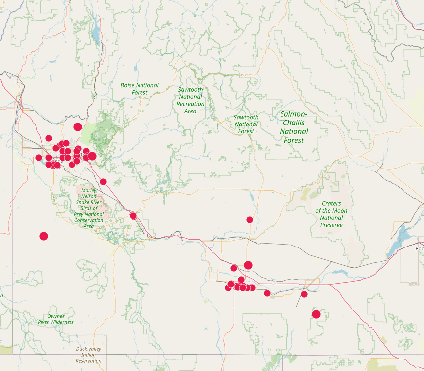
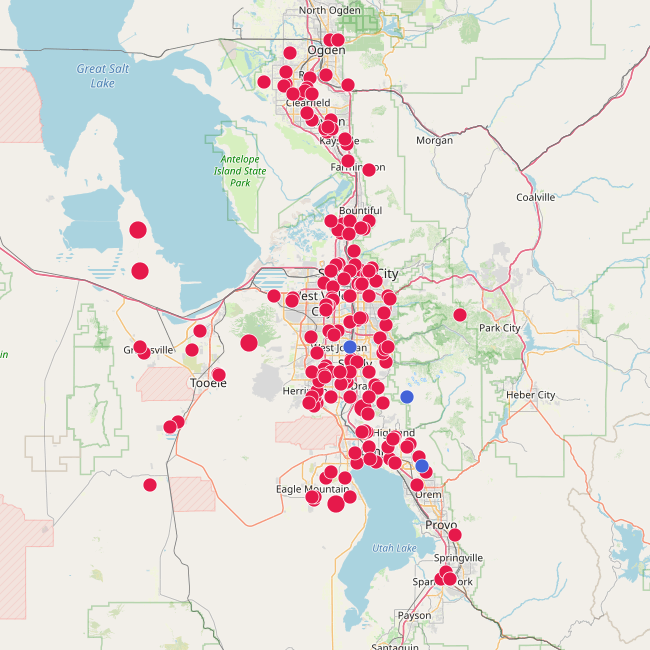

# Freq51 - The Intermountain Mesh
Meshtastic® lets you use inexpensive LoRa radios as a long-range, off-grid communication platform where regular infrastructure is unreliable or unavailable. It’s community-driven and open source. Radios automatically form a mesh, forwarding packets to neighbors (up to 7 hops from origin). Phones are optional. **The Freq51 community** is building an open community mesh that anyone here can join. This network is intended as a Radio Frequency tool for emergency/disaster response and off-grid (non-internet) coordination and hobbyist projects. No license is required to use Meshtastic (unless you intentionally enable Ham Mode). Meshtastic is under active development and **not** a life-critical service. 

|  |  |
|:-------------------------------:|:----------------------------:|
| **Idaho**                       | **Utah**                     |
---

## Joining

1. **Get supported hardware** from the Meshtastic list.
2. **Join our [Discord](http://utahmesh.net)** for local help and announcements.
3. Read the **[FAQ](faq.md)** and **[Configuration](config.md)** pages below.
4. See **[Equipment](equipment.md)** for example builds / coverage once published, and **[Infrastructure](infrastructure.md)** for deployed nodes.

**Links**
- Supported Hardware: [https://meshtastic.org/docs/hardware/devices/](https://meshtastic.org/docs/hardware/devices/)
-  **[Official Meshtastic Discord](https://discord.gg/meshtastic) --> [Connect Forum](https://discord.com/channels/867578229534359593/1196916552725958706) --> US-Utah**

---

## MQTT

**MQTT** (Message Queue Telemetry Transport) is a lightweight pub/sub protocol. Meshtastic can uplink device info and messages to an MQTT server. This enables:

- **Computer ↔ node** integrations without using LoRa.
- **Uplink/Downlink bridging** so two distant nodes can exchange messages via internet when out of LoRa range. We are building a pure LoRa mesh, and do not support MQTT downlink/bridging.
- **Maps & analytics** (position/telemetry), delivery reports, and tooling. If you want your node on the map. 

**Our stance:** We prioritize a healthy **RF mesh** first. MQTT is useful for mapping and analytics. Please do not flood the RF network with downlinked internet traffic.

**Good practices**
- If your node is **directly connected** to an MQTT server, **do not enable downlink** on public RF channels (e.g., MediumFast). That can spam RF. Nodes not on MQTT can use “Ignore MQTT,” and that setting is requested to be on by default when operating on our mesh unless you need MQTT. "Ok to MQTT" enabled will allow your node to show up on our MQTT feeders.

---

## Member Projects

Some cool freq51-adjacent projects we love to showcase (add yours!):

- TBD

> Submit a PR to add your project here.

---

## Other Local Groups

Meshtastic keeps a running list of local groups worldwide. If you’re traveling or collaborating across regions, check there and cross-link back to freq51 once we’re listed.

- Meshtastic Local Groups Directory: [https://meshtastic.org/docs/community/local-groups/](https://meshtastic.org/docs/community/local-groups/)

