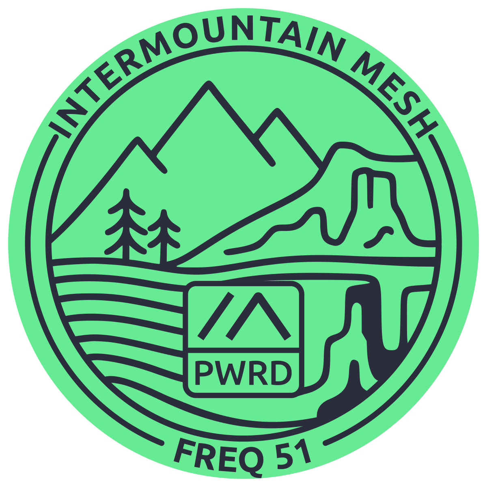
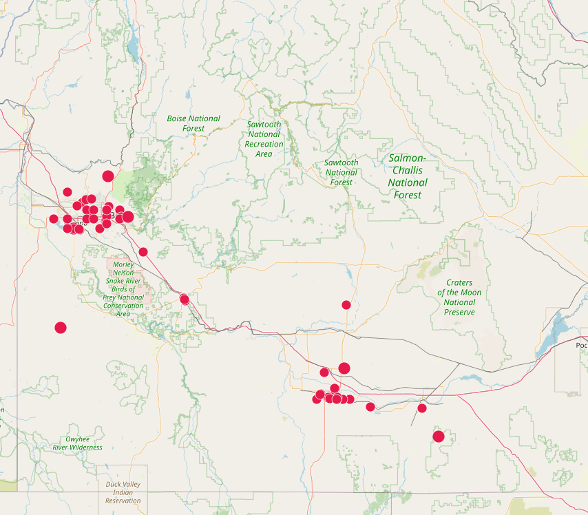
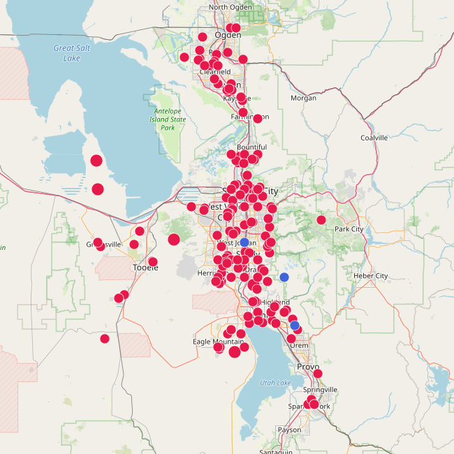

# Freq51 - The Intermountain Mesh
Meshtastic® is a network protocol that lets you use [inexpensive radios](https://meshtastic.org/docs/hardware/devices/) for long-range, off-grid communication where regular infrastructure is unreliable or unavailable. Radios (nodes) automatically share messages when using the [same settings](config.md), forwarding packets to neighbors up to 7 hops from where a message started. Phones are optional. Users can send text messages in channels or DMs, and share position or weather data if using a device with connected sensors.

The [Freq51 community](https://utahmesh.net) is building one such mesh network that spans Utah and Idaho that anyone can join. The network is intended for non-life-critical emergency/disaster communication, off-grid coordination, and hobbyist projects. You don't need a license to use Meshtastic (unless you intentionally enable Ham mode), just a compatible radio.

|  |  |
|:-------------------------------:|:----------------------------:|
| **Idaho**                       | **Utah**                     |
---

## How to get started

1. **Buy or build a node** You can use any [Meshtastic supported device](https://meshtastic.org/docs/hardware/devices/) but if you are new, buying one that already has battery, antennas, GPS (if desired), and case is a solid option. Some sellers may need you to select a frequency option, in which case select 915Mhz (US region). You can fully use and configure your device from a computer or cell phone, so features like screen, keyboard, or buttons are entirely optional.
2. **Configure your device** Our [onboarding guide](onboarding.md) will help you update your firmware, load settings to connect to the Freq51 network, and help you choose your node role.
3. **Join our [Discord](https://utahmesh.net)** for local help and announcements.
4. If you are curious about how the network works, read our **[FAQ](faq.md)**, **[Configuration](config.md)**, and **[Infrastructure](infrastructure.md)** for more info

**Links**
-  **[Official Meshtastic Discord](https://discord.gg/meshtastic) --> [Connect Forum](https://discord.com/channels/867578229534359593/1196916552725958706) --> US-Utah**

---

## MQTT

**MQTT** (Message Queue Telemetry Transport) is a lightweight pub/sub protocol. Meshtastic can uplink device info and messages to an MQTT server. This enables:

- **Computer ↔ node** integrations without using LoRa.
- **Uplink/Downlink bridging** so two distant nodes can exchange messages via internet when out of LoRa range. We are building a pure LoRa mesh, and do not support MQTT downlink/bridging.
- **Maps & analytics** (position/telemetry), delivery reports, and tooling. If you want your node on the map. 

**Our stance:** We prioritize a healthy **RF mesh** first. MQTT is useful for mapping and analytics. Please do not flood the RF network with downlinked internet traffic.

**Good practices**
- If your node is **directly connected** to an MQTT server, **do not enable downlink** on public RF channels (e.g., MediumFast). That can spam RF. Nodes not on MQTT can use “Ignore MQTT,” and that setting is requested to be on by default when operating on our mesh unless you need MQTT. "Ok to MQTT" enabled will allow your node to show up on our MQTT feeders.

---

## Member Projects

Some cool freq51-adjacent projects we love to showcase (add yours!):

- TBD

> Submit a PR to add your project here.

---

## Other Local Groups

Meshtastic keeps a running list of local groups worldwide. If you’re traveling or collaborating across regions, check there and cross-link back to freq51 once we’re listed.

- Meshtastic Local Groups Directory: [https://meshtastic.org/docs/community/local-groups/](https://meshtastic.org/docs/community/local-groups/)

