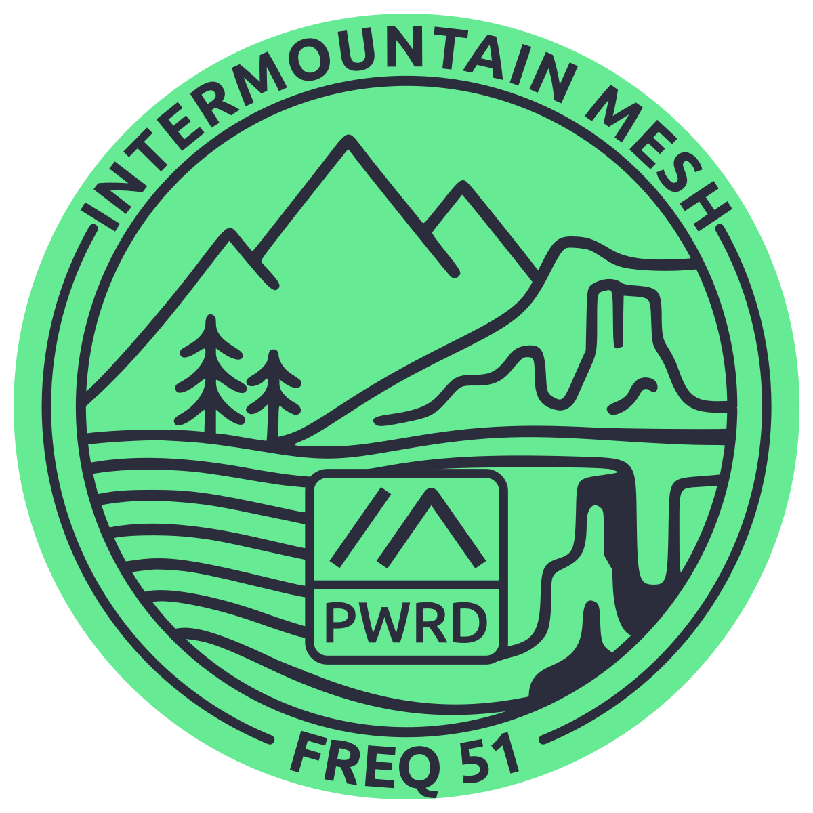
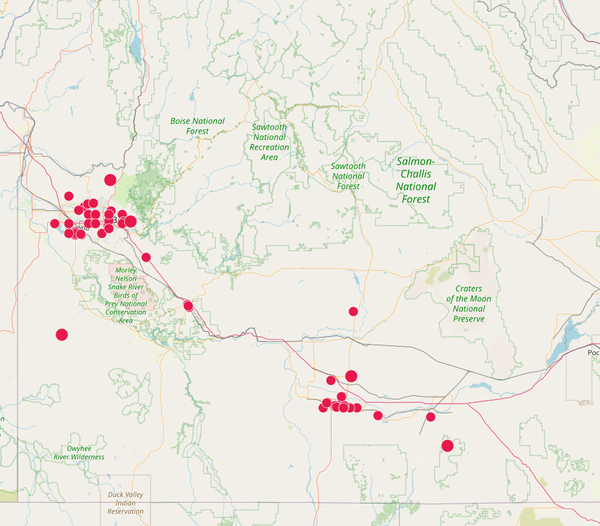
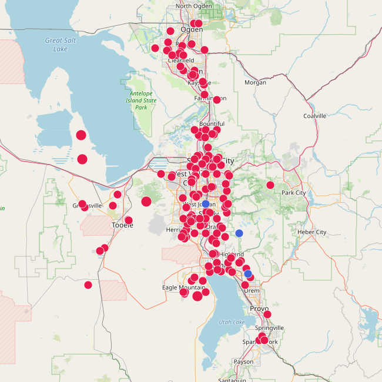

# Freq51 - The Intermountain Mesh
Meshtastic® lets you use inexpensive LoRa radios for long-range, off-grid communication when regular infrastructure is unreliable or unavailable. Its nodes form a community-driven, open-source mesh, forwarding messages up to seven hops; a phone is optional. You can send channel messages or direct messages and, with compatible hardware, share position or weather data.

**The Freq51 community** is building an open mesh that anyone can join across Utah and Idaho. The network is intended as a radio-frequency tool for emergency and disaster response, off-grid coordination, and hobbyist projects. No license is required to use Meshtastic unless you intentionally enable Ham Mode. Meshtastic is under active development and **not** a life-critical service.

|  |  |
|:-------------------------------:|:----------------------------:|
| **Idaho**                       | **Utah**                     |
---

## Start Here

New to Freq51? Start with the **[Start Here guide](start-here.md)** for device selection, Alpha firmware, community settings, testing, and help.

1. **Get supported hardware** from the Meshtastic list.
2. **Join our [Freq51 Discord](https://discord.gg/qmeeRPkq3g)** for local help and announcements.
3. Read the **[FAQ](faq.md)** and **[Configuration](config.md)** pages for additional detail.
4. See **[Equipment](equipment.md)** for example builds and **[Infrastructure](infrastructure.md)** for deployed nodes.

**Links**
- Supported Hardware: [https://meshtastic.org/docs/hardware/devices/](https://meshtastic.org/docs/hardware/devices/)
-  **[Official Meshtastic Discord](https://discord.gg/meshtastic) --> [Connect Forum](https://discord.com/channels/867578229534359593/1196916552725958706) --> US-Utah**

---

## MQTT

**MQTT** (Message Queue Telemetry Transport) is a lightweight pub/sub protocol. Meshtastic can uplink device info and messages to an MQTT server. This enables:

- **Computer ↔ node** integrations without using LoRa.
- **Uplink/Downlink bridging** so two distant nodes can exchange messages via internet when out of LoRa range. We are building a pure LoRa mesh, and do not support MQTT downlink/bridging.
- **Maps & analytics** (position/telemetry), delivery reports, and tooling. If you want your node on the map. 

**Our stance:** We prioritize a healthy **RF mesh** first. MQTT is useful for mapping and analytics. Please do not flood the RF network with downlinked internet traffic.

**Good practices**
- If your node is **directly connected** to an MQTT server, **do not enable downlink** on public RF channels (e.g., MediumFast). That can spam RF. Nodes not on MQTT can use “Ignore MQTT,” and that setting is requested to be on by default when operating on our mesh unless you need MQTT. "Ok to MQTT" enabled will allow your node to show up on our MQTT feeders.

---

## Member Projects

Community projects, hardware builds, coverage reports, and tools are welcome. See [Contribute to Freq51](contribute.md) for what to share and how to get it reviewed.

---

## Other Local Groups

Meshtastic keeps a running list of local groups worldwide. If you’re traveling or collaborating across regions, check there and cross-link back to freq51 once we’re listed.

- Meshtastic Local Groups Directory: [https://meshtastic.org/docs/community/local-groups/](https://meshtastic.org/docs/community/local-groups/)

*Last edited: August 6, 2026*

