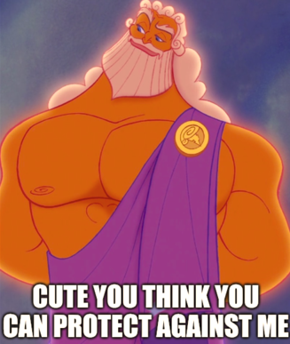

# Zeus Protection: Protecting Your Meshtastic Node from Lightning Strikes

---

Lightning strikes are a serious threat to any outdoor electronics, including your Meshtastic node. While nothing can guarantee absolute protection (Zeus always has the last word!), you can dramatically reduce your risk by using proper hardware and best practices.

## Why Worry About Lightning?

- **Lightning can induce massive voltages in antennas and cables—even if it doesn’t strike directly.**
- **Damage can travel through antenna cables and power lines, destroying your radio and even other equipment.**
- **Well-chosen protection can save your gear and even prevent fires.**

---

## Core Protection Hardware

1. **Lightning Arrestor (Coaxial Surge Protector)**
   - Install an inline lightning arrestor between your antenna and your node’s radio.
   - Look for models rated for your frequency (e.g., 400-470 MHz for Meshtastic).
   - Example: PolyPhaser IS-B50LN-C2 or ALPHA DELTA ATT3G50U.
   - Arrestors need to be properly grounded to be effective!

2. **Grounding Rod**
   - Connect the lightning arrestor to a dedicated ground rod driven several feet into the earth.
   - Use thick copper wire (at least 10 AWG, or 6mm²) for the ground connection.
   - Keep the ground wire as short and straight as possible.

3. **Antenna Placement**
   - Mount antennas away from the highest points on a building if possible.
   - Avoid mounting directly atop metal masts unless properly grounded.

4. **Ferrite Beads/Chokes**
   - Add ferrite beads to power and data cables entering your node enclosure.
   - This helps suppress voltage spikes from nearby lightning.

5. **Weatherproofing**
   - Use weatherproof enclosures to protect against water ingress, which can worsen lightning damage.
   - Seal all cable entries.

---

## Installation Example

1. Mount your antenna securely.
2. Attach one side of the lightning arrestor to the antenna cable.
3. Attach the other side to your Meshtastic node’s radio input.
4. Connect the arrestor’s ground terminal to your ground rod using thick copper wire.
5. Add ferrite chokes to the power cable before it enters the enclosure.

---

## Additional Tips

- **Disconnect during storms:** If possible, unplug antennas and power during severe weather.
- **Inspect periodically:** Check ground connections and arrestors for corrosion or damage.
- **Insurance:** Consider insuring expensive network nodes or setups.

---

## Can You Really Protect Against Zeus?

Nothing is foolproof—lightning is unpredictable and immensely powerful (just ask Zeus!). But good grounding and surge protection make a huge difference, turning a likely catastrophe into a survivable event.

Stay safe, and may your mesh be ever resilient!

---