# Freq51 Infrastructure

This page lists deployed routers, router late nodes, and strategically placed clients. Each entry has a spec table followed by a **site survey** with associated images. North views are shown first when both are available.

**Last verified:** August 6, 2026. Entries marked **Unverified/incomplete** have a current MeshView reference but still need deployment details confirmed.

For deployment guidelines, see [Router Deployment Guide](advanced-configuration/router-deployment.md).

---

# Table of Contents

## [Utah Infrastructure](#utah-infrastructure)
- [Routers](#routers)
	- [FPR — Francis Peak Router](#fpr--francis-peak-router)
	- [LMR — Lake Mountain Router](#lmr--lake-mountain-router)
  	- [MPR — Mendon Peak Router](#mpr--mendon-peak-router)
  	- [NPR — Nelson Peak Router](#npr--nelson-peak-router)
	- [Fool Creek](#fcre--fool-creek)
	- [KYHV — Kyhv Router V2](#kyhv--kyhv-router-v2)
	- [🐞 — Wasatch Plateau](#--wasatch-plateau)

- [Utah Router Late Nodes](#utah-router-late-nodes)
	- [AUR — Aurora Uranialis](#aur--aurora-uranialis)
	- [CBT — Cache Butte Tower](#cbt--cache-butte-tower)
	- [POTM — Point of the Mountain](#potm--point-of-the-mountain)
   	- [STIR — Stansbury Island RTR](#stir--stansbury-island-rtr)
	- [☀ — Murray Suncatcher](#--murray-suncatcher)
	- [ROCK — The Rock](#rock--the-rock)
	- [WMTN — West Mountain](#wmtn--west-mountain)

- [Strategic Clients](#strategically-placed-clients)
	- [👽 — Alien Tower 🛸](#--alien-tower-)
	- [C6C — Aurora Ceresia](#c6c--aurora-ceresia)
	- [WC1 — Wasatch Crest 1](#wc1--wasatch-crest-1)
	- [WC2 — Wasatch Crest 2](#wc2--wasatch-crest-2)

## [Southern Idaho Infrastructure](#southern-idaho-infrastructure)
- [Routers](#routers-1)
	- [MHR — Mount Harrison Router](#mhr--mount-harrison-router)
    - [ISR — Indian Springs Router](#isr--indian-springs-router-v2)
    - [T2T — The 2 Towers](#t2t--the-2-towers)
    - [PMR — Pioneer Mountain Router](#pmr--pioneer-mountain-router)

- [Strategic Clients](#strategically-placed-clients-1)
    - [SSL — Second Star Labs](#ssl--second-star-labs)
    - [STLR — Stellar](#stlr--stellar)

## [Western Idaho Infrastructure](#western-idaho-infrastructure)
- [Mountain Home](#mountain-home)
  - [Routers](#routers-2)
    - [tcup — MH Teacup Foothills](#tcup--mh-teacup-foothills)
    - [MHDR — MH Danskin Repeater V2](#mhdr--mh-danskin-repeater-v2)
  - [Mountain Home Router Late Nodes](#mountain-home-router-late-nodes)
    - [RBR — Rattlesnake Butte Repeater](#rbr--rattlesnake-butte-repeater)
    - [MHR — MH Foothills Repeater](#mhr--mh-foothills-repeater)
- [Treasure Valley](#treasure-valley)
  - [Routers](#routers-3)
    - [HPR — Hayden Peak Router](#hpr--hayden-peak-router)
    - [TVM Pearl](#tvm-pearl)
    - [TVM Tablerock](#tvm-tablerock)
    - [SQB — SWIARC-SQB](#sqb--swiarc-sqb)

---

# Utah Infrastructure
Infrastructure located within Utah.

## Routers

### FPR — Francis Peak Router
**Location:** Francis Peak (Tertiary Peak)

| Node Name              | Radio                            | Antenna        | Battery                           | Solar | Modem Preset | Slot | Rebroadcast Mode | Firmware |
|------------------------|----------------------------------|----------------|-----------------------------------|-------|--------------|------|------------------|----------|
| FPR – Francis Peak Router v5 | Femtofox CE + Baymesh 3 filter | Alfa 5 dBi Omni| 3S3P 18650  | Eco-Worthy 25W   | MEDIUM_FAST    | 51   | ALL              | 2.6.11   |

#### Site survey
**North**  
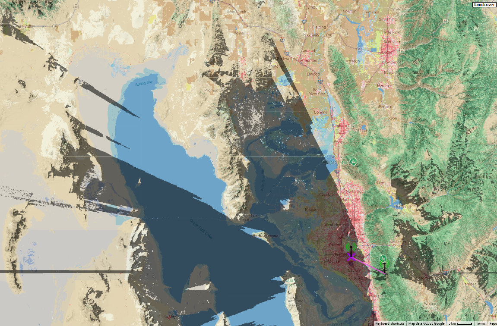

**South**  
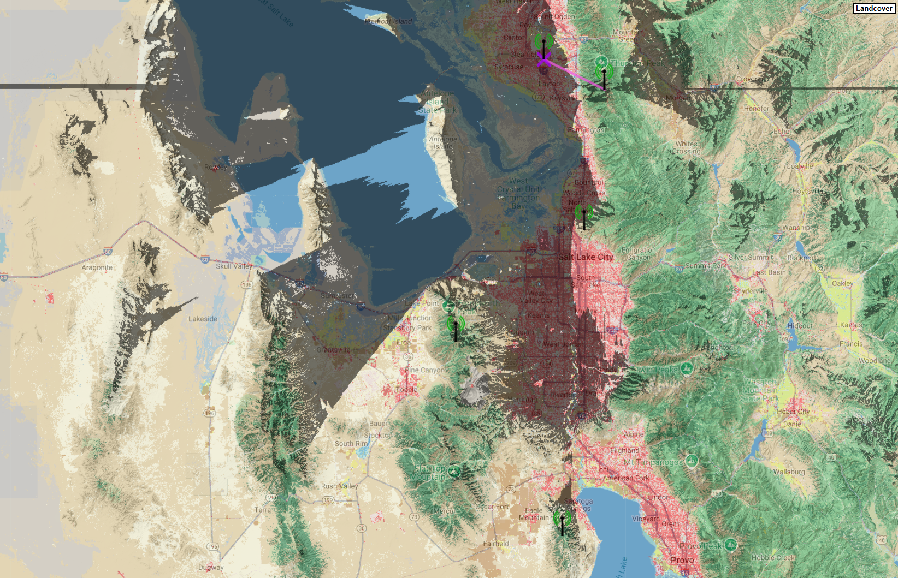

---

### LMR — Lake Mountain Router
**Location:** Lake Mountain Radio Tower

| Node Name               | Radio (modules + enclosure)                                          | Antenna | Battery    | Solar | Modem Preset | Slot | Rebroadcast Mode | Firmware             |
|--------------------------|---------------------------------------------------------------------|---------|------------|-------|--------------|------|------------------|----------------------|
| LAKE – Lake Mountain Rtr | RPi CM3 · Ebyte E22-900M30S · Taoglas filter · Nebra Miner Enclosure| 3 dBi   | Hard-wired | N/A   | MEDIUM_FAST    | 51   | ALL              | Latest Alpha (auto)  |

#### Site survey
**North/South**  
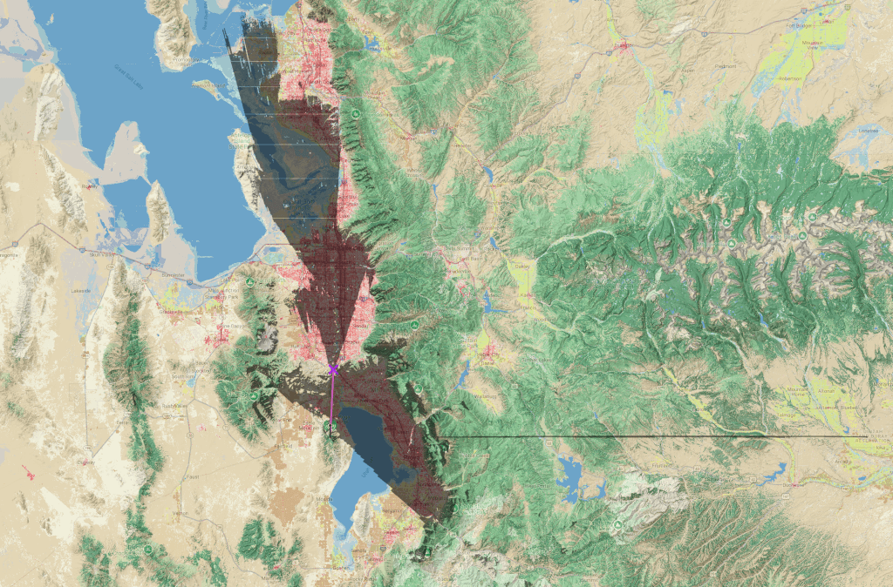

---

### MPR — Mendon Peak Router
**Location:** Mendon Peak

| Node Name                | Radio (modules + enclosure)                | Antenna            | Battery                                                         | Solar | Modem Preset | Slot | Rebroadcast Mode | Firmware |
|--------------------------|--------------------------------------------|--------------------|-----------------------------------------------------------------|-------|--------------|------|------------------|----------|
| MPR – Mendon Peak Router | Washtastic compatible with Taoglas filter    | Alfa 5 dBi   | 3S2P Samsung pack with balancing BMS  | Dual 1.5 W panels  | MEDIUM_FAST  | 51   | ALL              | 2.7.18    |

#### Site survey
**North**  
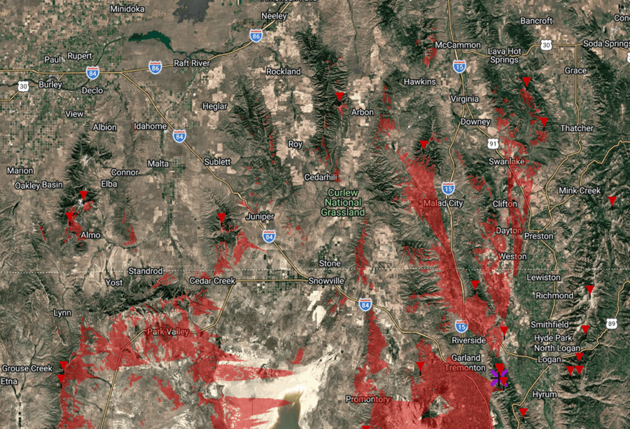

**South**  
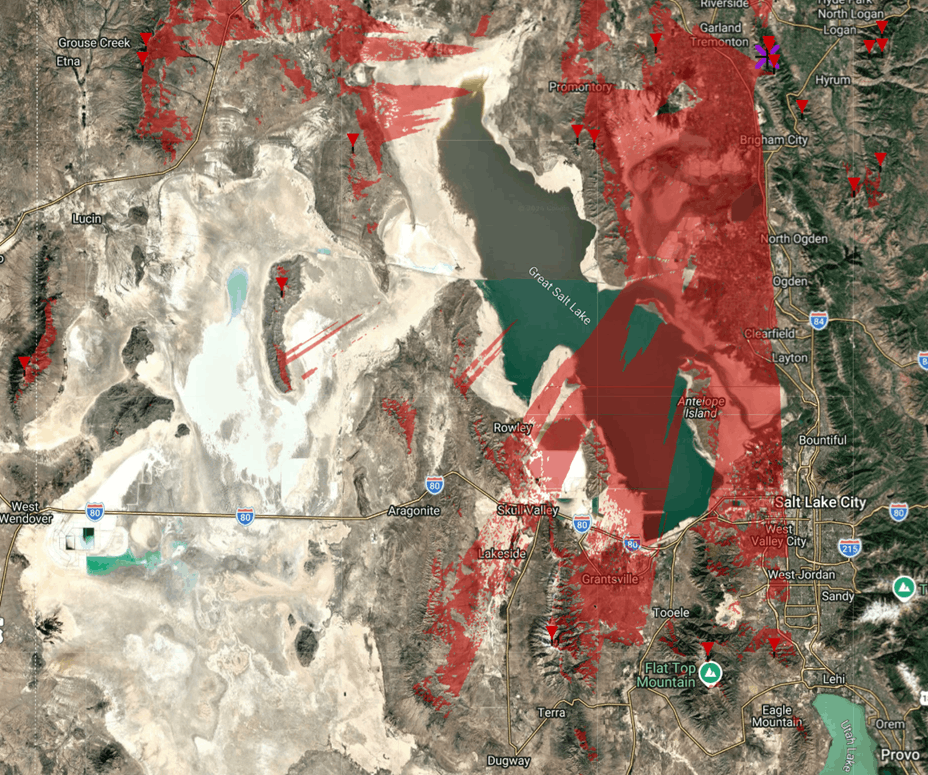

---

### NPR — Nelson Peak Router
[View in MeshView](https://meshview.freq51.net/node/3699380305)

**Location:** Nelson Peak

| Node Name                | Radio (modules + enclosure)                | Antenna            | Battery                                                         | Solar | Modem Preset | Slot | Rebroadcast Mode | Firmware |
|--------------------------|--------------------------------------------|--------------------|-----------------------------------------------------------------|-------|--------------|------|------------------|----------|
| NPR – Nelson Peak Router | Nebra with 1 W radio and a Murata filter    | 45 cm Gizont 7 dBi   | PoE-powered GOLDENMATE 1000 VA/800 W lithium UPS battery backup  | None  | MEDIUM_FAST  | 51   | ALL              | 2.7.13    |

#### Site survey
**North**  
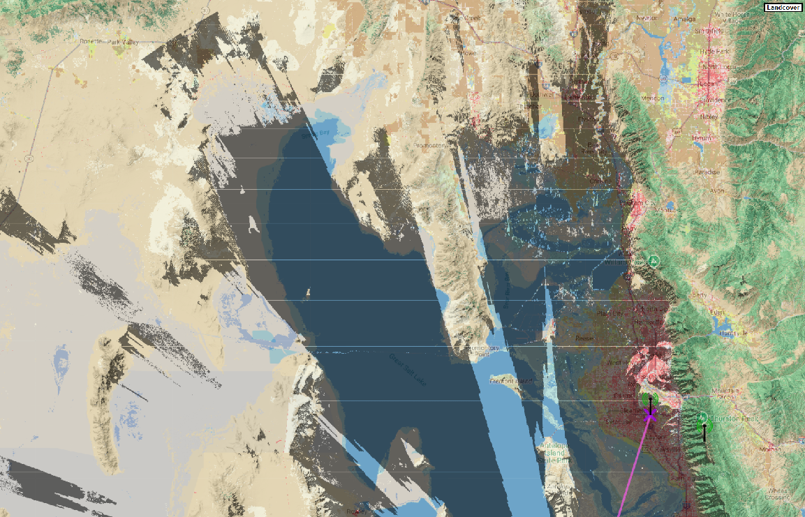

**South**  
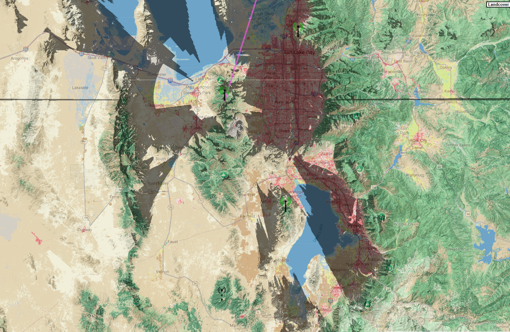

---

### fcre — Fool Creek
[View in MeshView](https://meshview.freq51.net/node/2560057003)

> **Unverified/incomplete — Router.** Current MeshView GPS: 39.39000, -112.20000. Deployment details pending.

---

### KYHV — Kyhv Router V2
[View in MeshView](https://meshview.freq51.net/node/2864785128)

> **Unverified/incomplete — Router.** Current MeshView GPS: 40.27000, -111.61000. Deployment details pending.

---

### 🐞 — Wasatch Plateau
[View in MeshView](https://meshview.freq51.net/node/3806656848)

> **Unverified/incomplete — Router.** Current MeshView GPS: 39.48000, -111.33000. Deployment details pending.

---

## Utah Router Late Nodes

### AUR — Aurora Uranialis
[View in MeshView](https://meshview.freq51.net/node/3579472290)

**Location:** Ensign Peak

| Node Name             | Radio                          | Antenna        | Battery                        | Solar | Modem Preset | Slot | Rebroadcast Mode | Firmware |
|-----------------------|--------------------------------|----------------|--------------------------------|-------|--------------|------|------------------|----------|
| AUR – Aurora Uranialis| RAK4631 + GPIO Labs ISM filter | Alfa 5 dBi Omni| 1S4P 21700 Molicel P50B (20 Ah)| 10 W  | MEDIUM_FAST    | 51   | ALL              | 2.6.4    |

Includes BME680 telemetry every 1800 s.

#### Site survey
**North**  
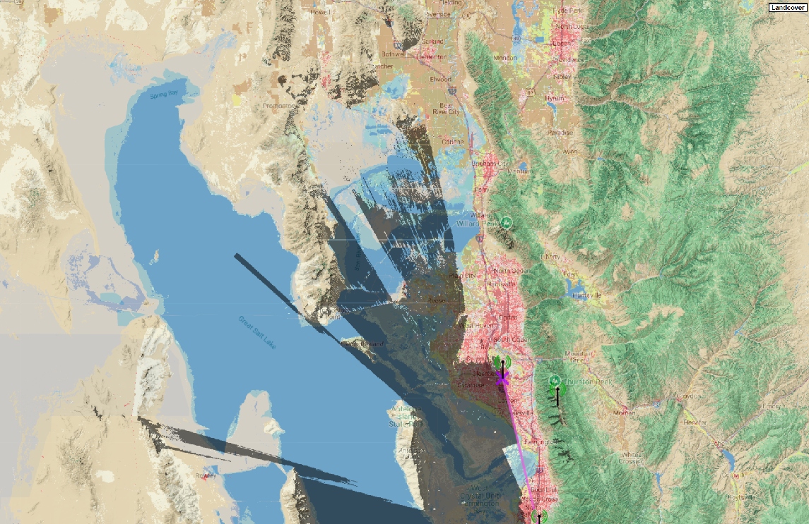

**South**  
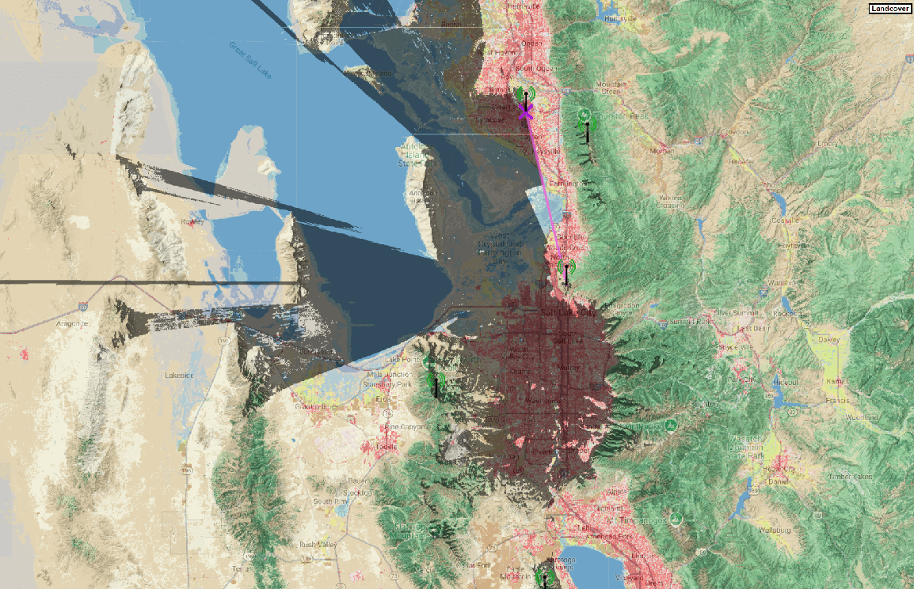

---

### POTM — Point of the Mountain
[View in MeshView](https://meshview.freq51.net/node/1999056159)

**Location:** North-facing ridgeline

| Node Name              | Radio              | Antenna | Battery   | Solar | Modem Preset | Slot | Rebroadcast Mode | Firmware |
|------------------------|-------------------|---------|-----------|-------|--------------|------|------------------|----------|
| POTM – Router Late     | RAK19003 + RAK4631| 4 dBi   | 2 × 18650 | 6 W   | MEDIUM_FAST    | 51   | ALL              | 2.6.10   |

#### Site survey
**North**  
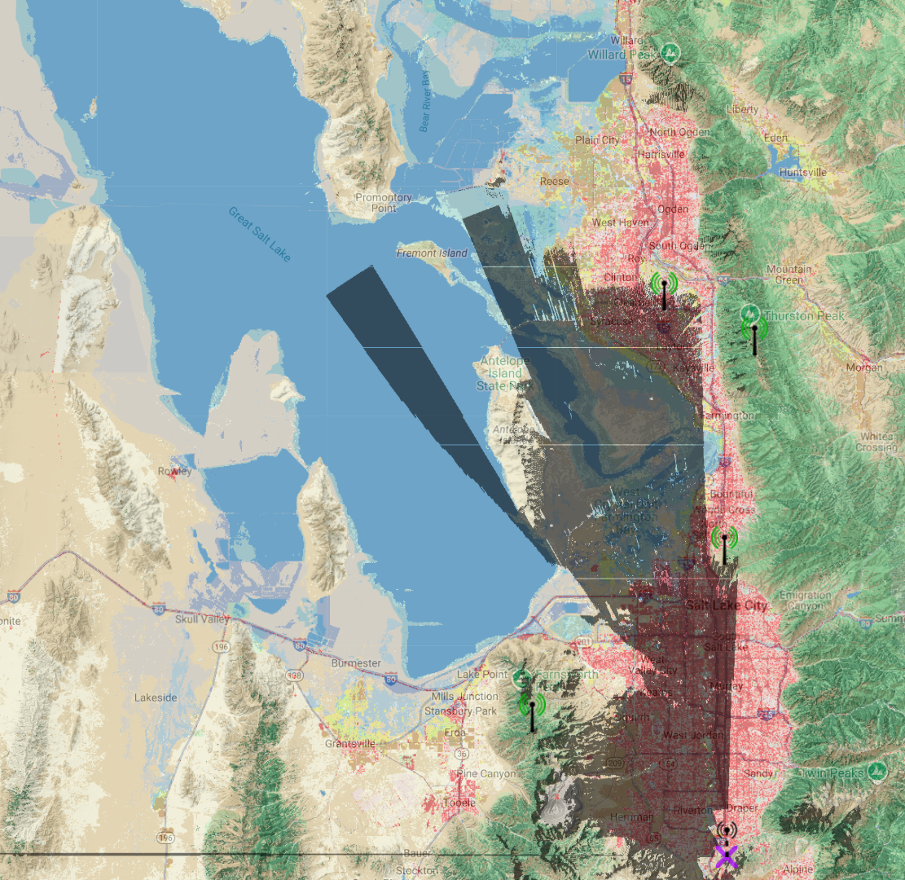

**South**  
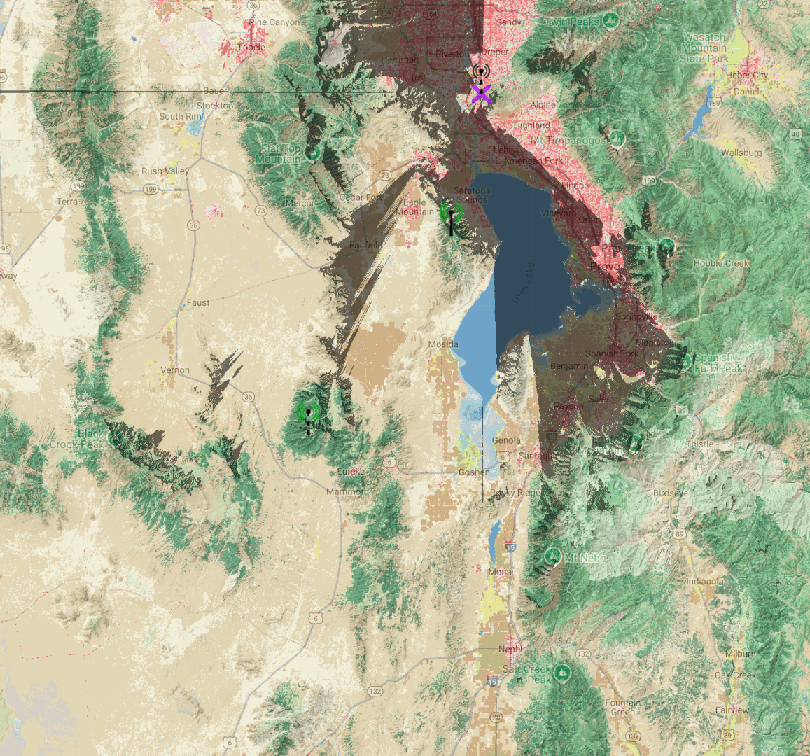

---

### STIR — Stansbury Island RTR
[View in MeshView](https://meshview.freq51.net/node/4168094141)

**Location:** Stansbury Island

| Node Name              | Radio              | Antenna | Battery   | Solar | Modem Preset | Slot | Rebroadcast Mode | Firmware |
|------------------------|-------------------|---------|-----------|-------|--------------|------|------------------|----------|
| STIR – Stansbury Island RTR | RAK4631 + BME680 + GPS | Alfa 5 dBi Omni | 16 Ah | 6 W | MEDIUM_FAST | 51 | ALL | 2.7.11 |

#### Site survey
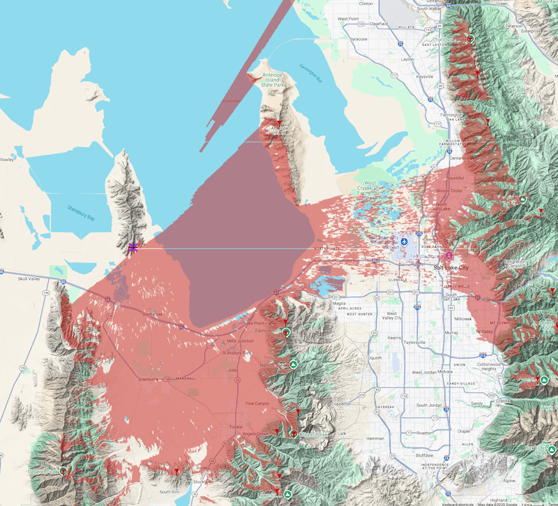

---

### ☀ — Murray Suncatcher
[View in MeshView](https://meshview.freq51.net/node/3938360070)

> **Unverified/incomplete — Router Late.** Current MeshView GPS: 40.65000, -111.85000. Deployment details pending.

---

### ROCK — The Rock 🪨
[View in MeshView](https://meshview.freq51.net/node/2642097705)

> **Unverified/incomplete — Router Late.** Current MeshView GPS: 41.19000, -111.92000. Deployment details pending.

---

### WMTN — West Mountain
[View in MeshView](https://meshview.freq51.net/node/4253670681)

> **Unverified/incomplete — Router Late.** Current MeshView GPS: 40.07000, -111.83000. Deployment details pending.

---

### CBT — Cache Butte Tower
**Location:** Cache Butte

| Node Name              | Radio              | Antenna | Battery   | Solar | Modem Preset | Slot | Rebroadcast Mode | Firmware |
|------------------------|-------------------|---------|-----------|-------|--------------|------|------------------|----------|
| CBT — Cache Butte Tower | Heltec V4 | eifagur "5.8 DBi" Anteanna |  House Battery   | None   | MEDIUM_FAST    | 51   | ALL              | 2.7.21   |

#### Site survey
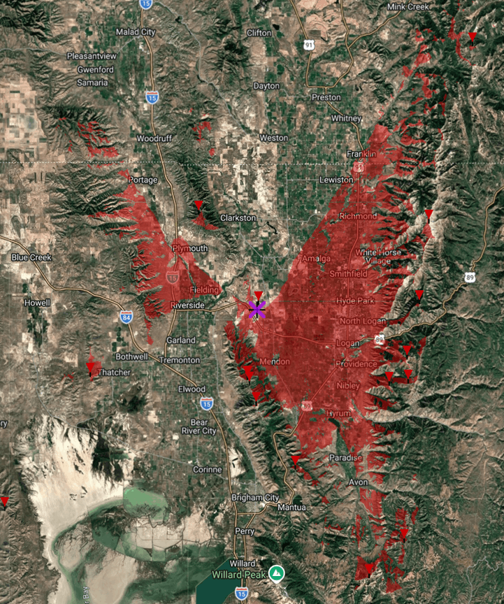

---

## Strategically Placed Clients

### 👽 — Alien Tower 🛸
[View in MeshView](https://meshview.freq51.net/node/3808683670)

**Location:** Alien Tower - Draper

| Node Name              | Radio                          | Antenna        | Battery                        | Solar | Modem Preset | Slot | Rebroadcast Mode | Firmware |
|------------------------|--------------------------------|----------------|--------------------------------|-------|--------------|------|------------------|----------|
| 👽 — Alien Tower 🛸   | RAK4631 + GPIO Labs ISM filter | Alfa 5 dBi Omni | 3 x 18650 | 6 W  | MEDIUM_FAST    | 51   | ALL              | 2.7.11    |

#### Site survey
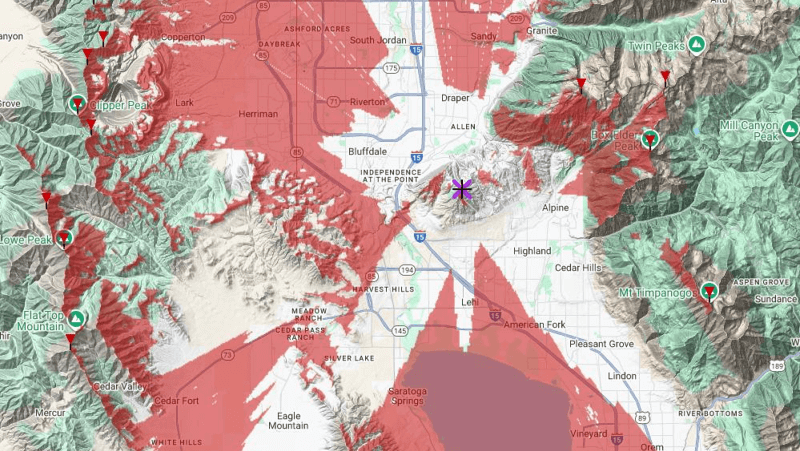

---

### C6C — Aurora Ceresia
**Location:** Hill AFB – Weber State overlook

| Node Name              | Radio                          | Antenna        | Battery                        | Solar | Modem Preset | Slot | Rebroadcast Mode | Firmware |
|------------------------|--------------------------------|----------------|--------------------------------|-------|--------------|------|------------------|----------|
| C6C – Aurora Ceresia   | RAK4631 + GPIO Labs ISM filter | Alfa 5 dBi Omni| 1S4P 21700 Molicel P50B (20 Ah)| 10 W  | MEDIUM_FAST    | 51   | ALL              | 2.6.4    |

#### Site survey
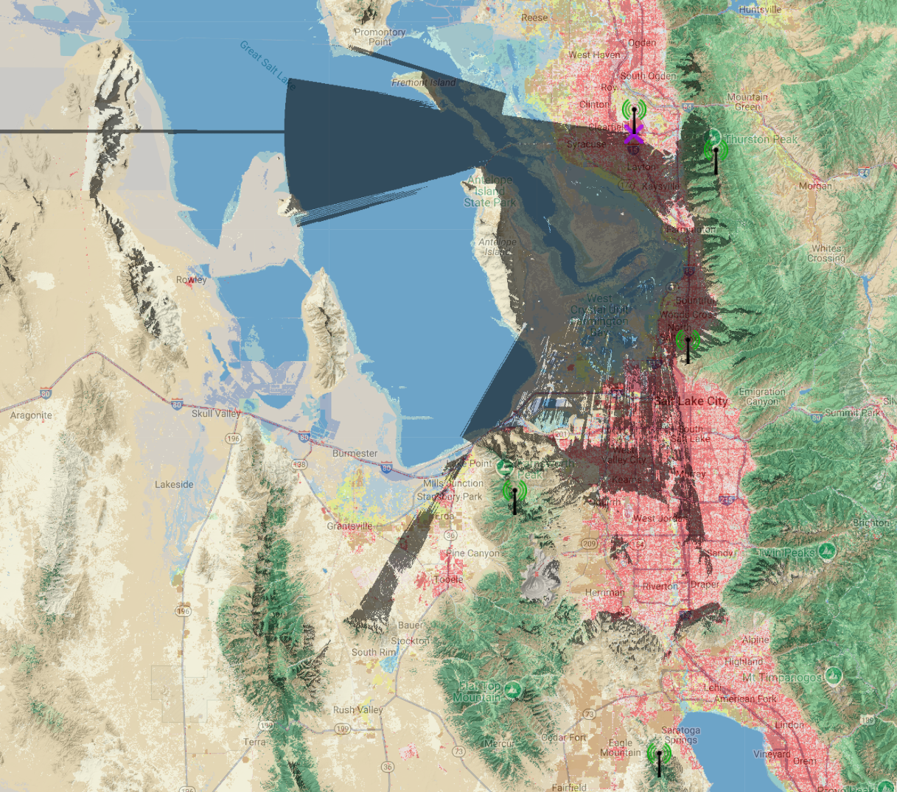

---

### WC1 — Wasatch Crest 1
[View in MeshView](https://meshview.freq51.net/node/4276995144)

**Location:** Silver Peak

| Node Name            | Radio   | Antenna        | Battery                    | Solar | Modem Preset | Slot | Rebroadcast Mode | Firmware |
|-----------------------|---------|----------------|----------------------------|-------|--------------|------|------------------|----------|
| WC1 – Wasatch Crest 1.1 | [SolarXiao Base](https://github.com/wehooper4/Meshtastic-Hardware/tree/main/XaioSeries/SolarXaio) + [Murata DFCB2915MLDJAA](https://www.mouser.com/catalog/specsheets/Murata%20DFCB_DFCH%20Series.pdf) | [Gizont 7 dBi, 45 cm](https://www.aliexpress.us/item/3256806241790045.html) | 1S4P [Molicel P45B](https://www.molicel.com/inr-21700-p45b/) (18 Ah) | 6 W | MEDIUM_FAST | 51 | ALL | 2.6.11 |

#### Site Survey
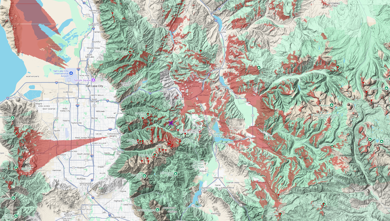

---

### WC2 — Wasatch Crest 2
[View in MeshView](https://meshview.freq51.net/node/1009212011)

**Location:** Squaretop
| Node Name            | Radio      | Antenna           | Battery                      | Solar | Modem Preset | Slot | Rebroadcast Mode | Firmware |
|-----------------------|------------|-------------------|------------------------------|-------|--------------|------|------------------|----------|
| WC2 – Wasatch Crest 2 | [XIAO NRF52](https://www.seeedstudio.com/XIAO-nRF52840-Wio-SX1262-Kit-for-Meshtastic-p-6400.html) + [Murata DFCB2915MLDJAA](https://www.mouser.com/catalog/specsheets/Murata%20DFCB_DFCH%20Series.pdf) | [Gizont 7 dBi, 45 cm](https://www.aliexpress.us/item/3256806241790045.html) | 1S2P [Molicel P45B](https://www.molicel.com/inr-21700-p45b/) (9 Ah) | 6 W | MEDIUM_FAST | 51 | ALL | 2.6.11 |

#### Site Survey
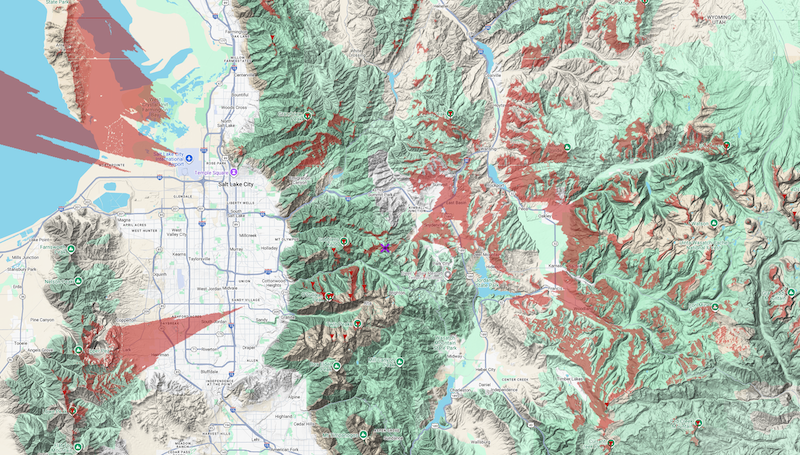
[Return to Table of Contents](#table-of-contents)

---

# Southern Idaho Infrastructure

Infrastructure physically located within Southern Idaho west of Mountain Home through Twin Falls, Burley, and the I-84 corridor to UT.

## Routers

### MHR — Mount Harrison Router
**Location**: Mount Harrison - Southern Idaho

| Node Name| Radio| Antenna| Battery| Solar| Modem Preset | Slot | Rebroadcast Mode | Firmware|
|-|-|-|-|-|-|-|-|-|
| MHR — Mount Harrison Router | Station-G2 | [Rokland 8 dBi low-profile omni](https://store.rokland.com/products/8-dbi-omni-outdoor-915mhz-fiberglass-antenna-for-lora-halow-application) | [3S8P, 12.6 V, 40 Ah](https://www.18650batterystore.com/collections/21700-batteries/products/eve-50e-21700-5000mah-15a-battery) | [25 W, 18 V ECO-WORTHY](https://a.co/d/85LSbHV) | MEDIUM_FAST | 51 | ALL | 2.6 |

#### Site Survey
**East**
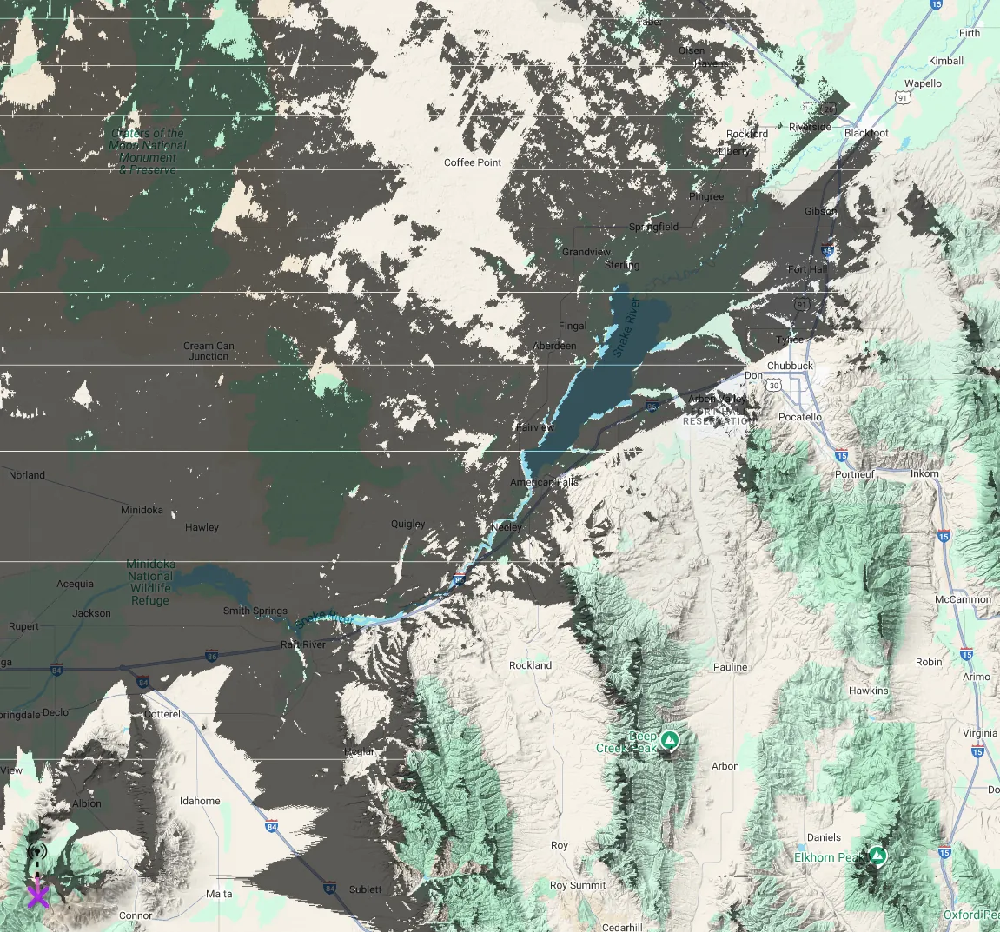

**West**
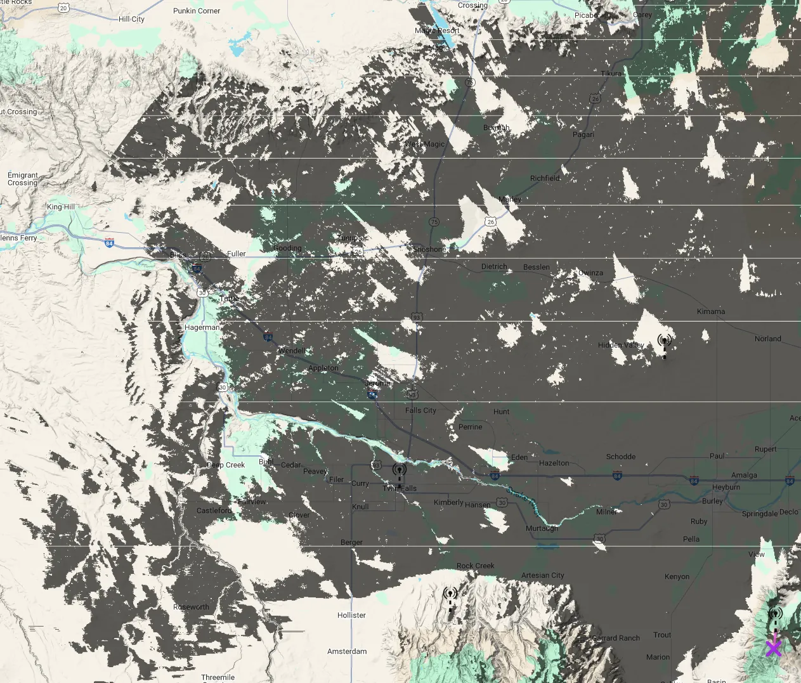

---

### ISR — Indian Springs Router v2
[View in MeshView](https://meshview.freq51.net/node/2732684740)

**Location**: South Hills - Sugarloaf

| Node Name| Radio| Antenna| Battery| Solar| Modem Preset | Slot | Rebroadcast Mode | Firmware       |
|-|-|-|-|-|-|-|-|-|
| ISR — Indian Springs Router v2 | RAK WisBlock 4631 + Airbuddy Amplifier | [ALFA 5 dBi omni](https://a.co/d/gPpWxbe) | [1S6P, 3.7 V, 40 Ah](https://www.18650batterystore.com/collections/21700-batteries/products/eve-50e-21700-5000mah-15a-battery) | [10 W, 18 V ECO-WORTHY](https://a.co/d/eiaV03W) | MEDIUM_FAST | 51 | ALL | 2.6.11 |

#### Site Survey
**East**
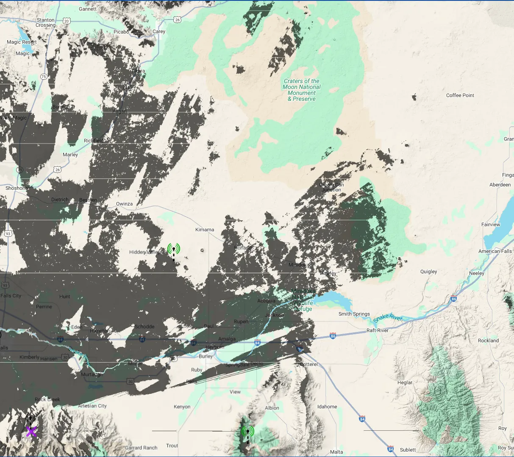

**West**
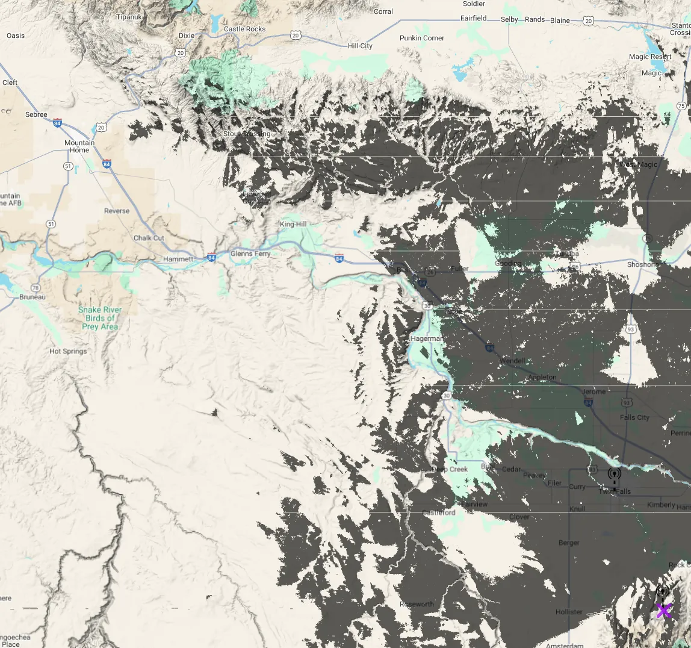

---

### T2T — The 2 Towers
[View in MeshView](https://meshview.freq51.net/node/470270179)

**Location**: Flat Top Butte, Jerome

| Node Name                      | Radio                                  | Antenna                                                                                                                                                                       | Battery                                                                                                                      | Solar                                                  | Modem Preset | Slot | Rebroadcast Mode | Firmware       |
|-|-|-|-|-|-|-|-|-|
| T2T — The 2 Towers | [wehooper4 SolarXiao Advanced + 1 W](https://github.com/wehooper4/Meshtastic-Hardware/tree/main/XaioSeries/SolarXaio) | [8 dBi omni](https://store.rokland.com/products/rakwireless-8-dbi-outdoor-fiberglass-helium-hotspot-antenna-us-868-915-mhz) + [Acasom cavity filter](https://acasom.com/products/915mhz-5-types-cavity-filter-for-helium-network-filter-waterproof-lora-indoor-use-high-out-band-rejection?variant=46125490405668) | [1S8P, 3.7 V, 40 Ah](https://www.18650batterystore.com/collections/21700-batteries/products/eve-50e-21700-5000mah-15a-battery) | [10 W, 18 V ECO-WORTHY](https://a.co/d/eiaV03W) | MEDIUM_FAST | 51 | ALL | 2.6.11 |

#### Site Survey
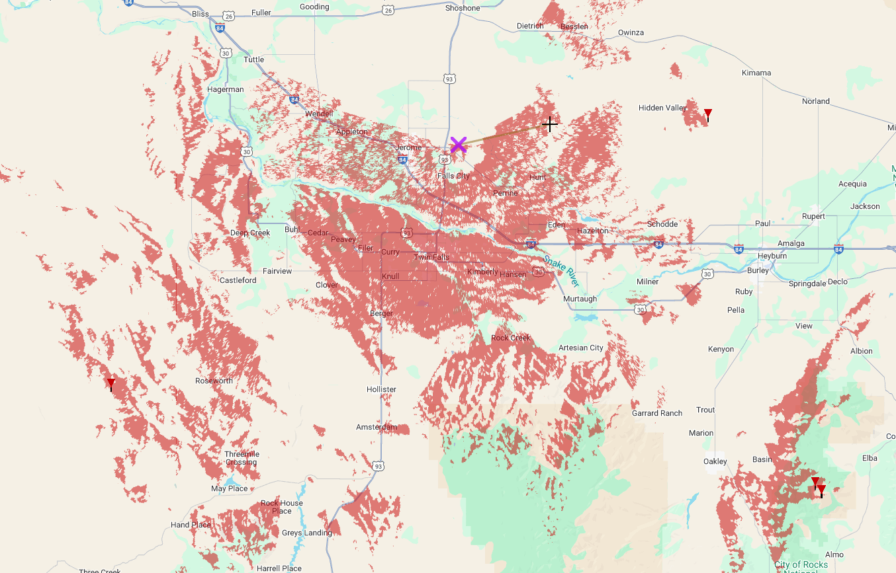

---

### PMR — Pioneer Mountain Router
[View in MeshView](https://meshview.freq51.net/node/3377436007)

> **Unverified/incomplete — Router.** Current MeshView GPS: 43.40000, -113.96000. Deployment details pending.

---

## Strategically Placed Clients

### SSL — Second Star Labs
**Location**: Second Star Labs, Twin Falls

| Node Name| Radio| Antenna| Battery| Solar| Modem Preset | Slot | Rebroadcast Mode | Firmware|
|-|-|-|-|-|-|-|-|-|
| SSL — Second Star Labs | Station G2 | [Rokland 10 dBi Backcountry](https://store.rokland.com/products/10-dbi-backcountry-n-male-omni-outdoor-helium-915-mhz-antenna-48-for-rak-miner-2-nebra-indoor-bobcat-hotspots) | [12 V, 16 Ah LiFePO4](https://a.co/d/hoMU9g7) | [25 W, 18 V ECO-WORTHY](https://a.co/d/85LSbHV) | MEDIUM_FAST | 51 | ALL | 2.6.11 |

#### Site Survey
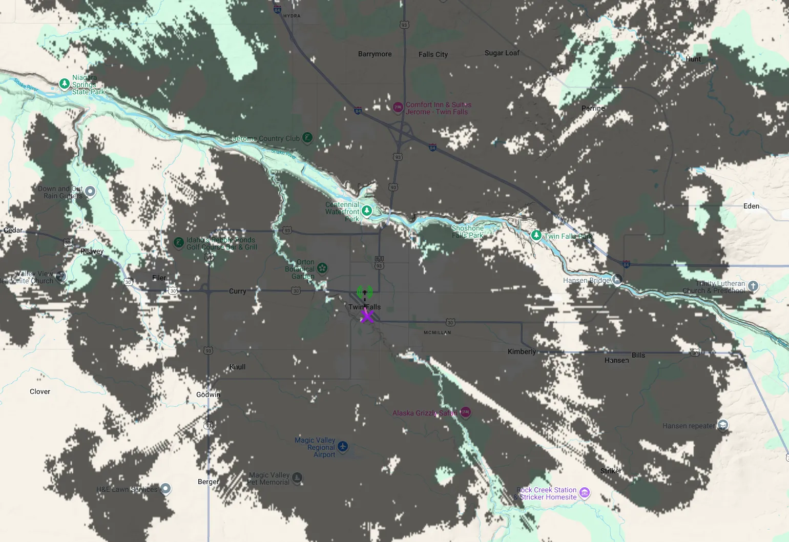

---

### STLR — Stellar
**Location**: Falls & Blue Lakes, Twin Falls

| Node Name| Radio| Antenna| Battery| Solar| Modem Preset | Slot | Rebroadcast Mode | Firmware|
|-|-|-|-|-|-|-|-|-|
| STLR — Stellar | RPi Zero 2 W + [1 W Wehooper ZebraHAT](https://github.com/wehooper4/Meshtastic-Hardware/tree/main/ZebraHAT) | [8 dBi omni](https://store.rokland.com/products/rakwireless-8-dbi-outdoor-fiberglass-helium-hotspot-antenna-us-868-915-mhz) | Grid PoE | Grid PoE | MEDIUM_FAST | 51 | ALL | 2.6.11 |

#### Site Survey
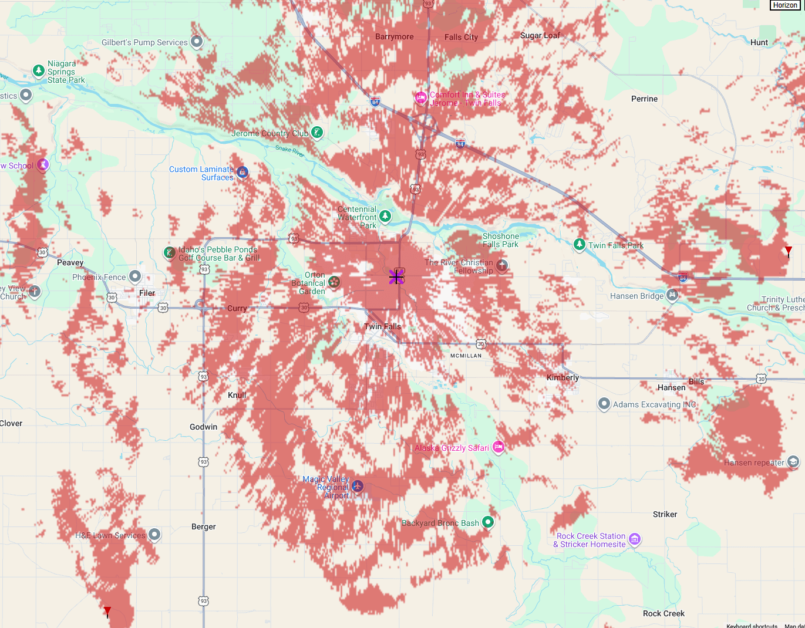

[Return to Table of Contents](#table-of-contents)

---

# Western Idaho Infrastructure
Infrastructure physically located within Western Idaho including Boise, Meridian, Nampa, Mountain Home and surrounding areas.

## Mountain Home

### Routers

#### tcup — MH Teacup Foothills
**Location**: Teapot Dome, Mountain Home

| Node Name| Radio| Antenna| Battery| Solar| Modem Preset | Slot | Rebroadcast Mode | Firmware|
|-|-|-|-|-|-|-|-|-|
| tcup — MH Teacup Foothills | [WisMesh 1 W Booster](https://store.rakwireless.com/products/wismesh-1w-booster-starter-kit) | [Rokland 8 dBi low-profile omni](https://store.rakwireless.com/products/8-dbi-omni-outdoor-915mhz-fiberglass-antenna-for-lora-halow-application) | [3.2 V, 20 Ah LiFePO4](https://www.amazon.com/Solar-20000mAh-LiFePO4-Battery-Controller) | [15 W, 5 V integrated panel and battery](https://www.amazon.com/Solar-20000mAh-LiFePO4-Battery-Controller) | MEDIUM_FAST | 51 | ALL | 2.7.15 |
#### Site Survey
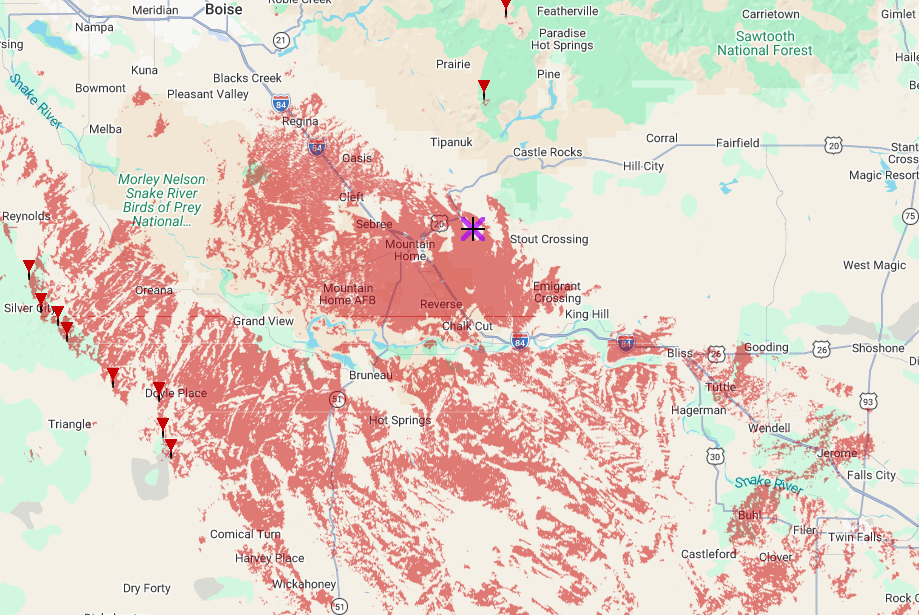

---

#### MHDR — MH Danskin Repeater V2
[View in MeshView](https://meshview.freq51.net/node/935622448)

**Location**: Danskin Peak — Mountain Home

| Node Name| Radio| Antenna| Battery| Solar| Modem Preset | Slot | Rebroadcast Mode | Firmware|
|-|-|-|-|-|-|-|-|-|
| MHDR — MH Danskin Repeater V2 | RAK WisBlock 4631 + Airbuddy Amplifier | [SlinkDSCO 5.8 dBi, 915 MHz](https://a.co/d/0gx4CRef) | 1S4P, 3.7 V 18650 | [10 W, 5 V Zivif](https://a.co/d/00EO1dZM) | MEDIUM_FAST | 51 | ALL | 2.7.15 |

#### Site Survey
**North**
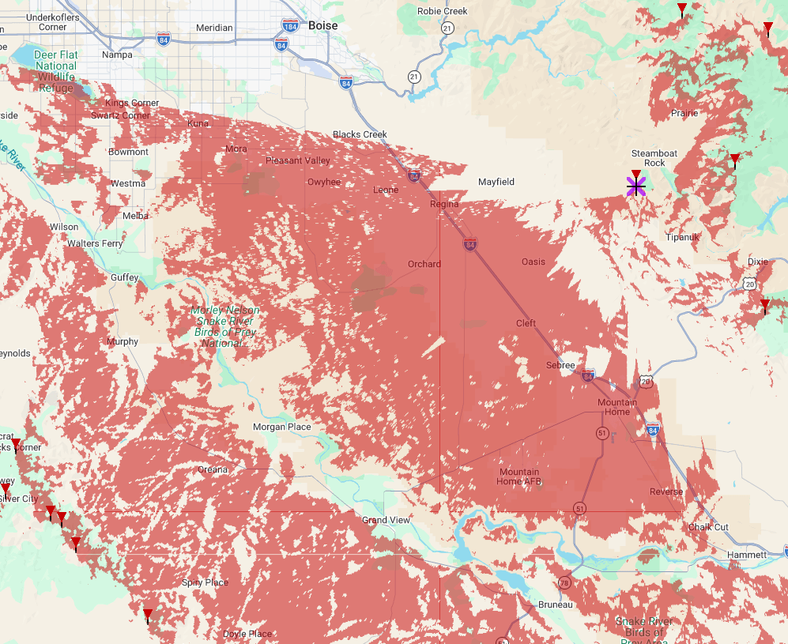

---

### Mountain Home Router Late Nodes

#### RBR — Rattlesnake Butte Repeater
[View in MeshView](https://meshview.freq51.net/node/185915364)

**Location**: Rattlesnake Butte, Mountain Home

| Node Name| Radio| Antenna| Battery| Solar| Modem Preset | Slot | Rebroadcast Mode | Firmware  |
|-|-|-|-|-|-|-|-|-|
| RBR — Rattlesnake Butte Repeater | [wehooper4 SolarXiao Advanced + 1 W](https://github.com/wehooper4/Meshtastic-Hardware/tree/main/XaioSeries/SolarXaio) | [SlinkDSCO 5.8 dBi, 915 MHz](https://a.co/d/0gx4CRef) | [3.2 V, 20 Ah LiFePO4](https://www.amazon.com/Solar-20000mAh-LiFePO4-Battery-Controller) | [15 W, 5 V integrated panel and battery](https://www.amazon.com/Solar-20000mAh-LiFePO4-Battery-Controller) | MEDIUM_FAST | 51 | ALL | 2.7.15 |

#### Site Survey
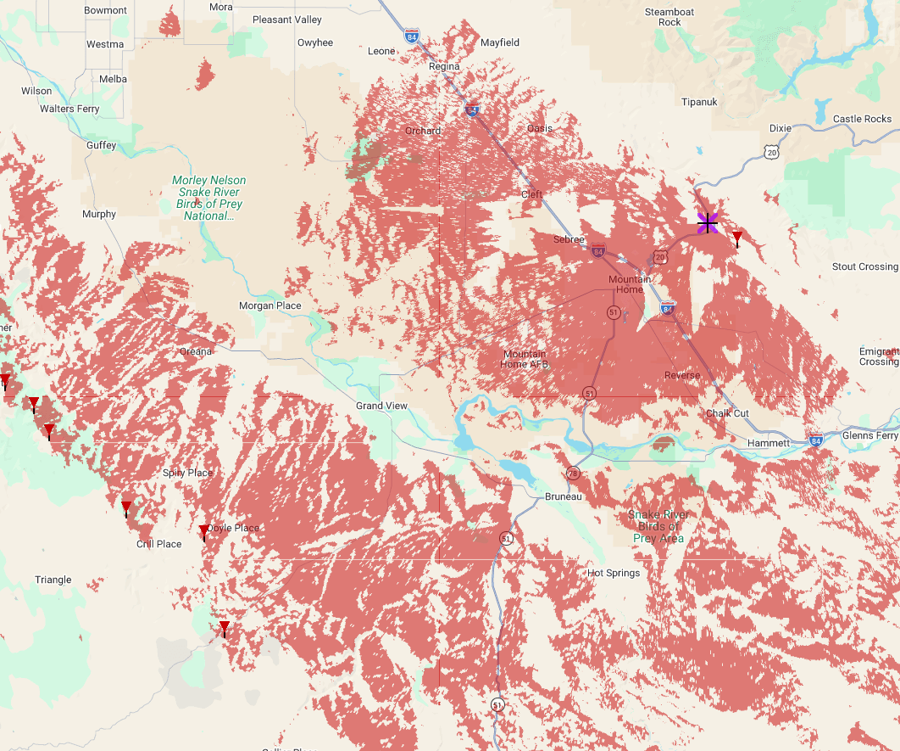

---

#### MHR — MH Foothills Repeater
**Location**: Mountain Home Foothills, Mountain Home

| Node Name| Radio| Antenna| Battery| Solar| Modem Preset | Slot | Rebroadcast Mode | Firmware|
|-|-|-|-|-|-|-|-|-|
| MHR — MH Foothills Repeater | RAK4631 | [SlinkDSCO 5.8 dBi, 915 MHz](https://a.co/d/0gx4CRef) | [3.2 V, 20 Ah LiFePO4](https://www.amazon.com/Solar-20000mAh-LiFePO4-Battery-Controller) | [15 W, 5 V integrated panel and battery](https://www.amazon.com/Solar-20000mAh-LiFePO4-Battery-Controller) | MEDIUM_FAST | 51 | ALL | 2.7.15 |

#### Site Survey
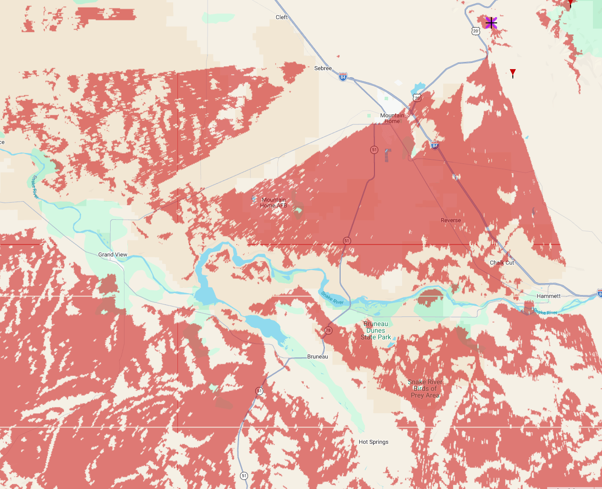
[Return to Table of Contents](#table-of-contents)

---

## Treasure Valley

### Routers

#### HPR — Hayden Peak Router
[View in MeshView](https://meshview.freq51.net/node/3546923185)

**Location**: Hayden Peak - Boise

| Node Name| Radio| Antenna| Battery| Solar| Modem Preset | Slot | Rebroadcast Mode | Firmware|
|-|-|-|-|-|-|-|-|-|
| HPR — Hayden Peak Router | Femtofox Pro | [Rokland 8 dBi low-profile omni](https://store.rokland.com/products/8-dbi-omni-outdoor-915mhz-fiberglass-antenna-for-lora-halow-application) | [1S8P, 3.7 V, 40 Ah](https://www.18650batterystore.com/collections/21700-batteries/products/eve-50e-21700-5000mah-15a-battery) | [25 W, 18 V ECO-WORTHY](https://a.co/d/85LSbHV) | MEDIUM_FAST | 51 | ALL | 2.6 |

**North**
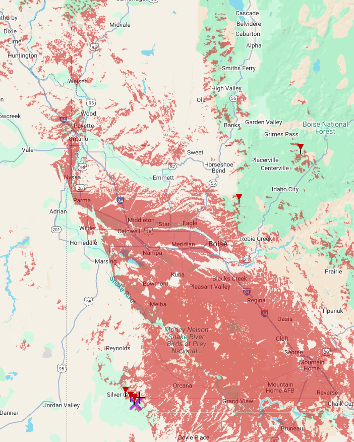

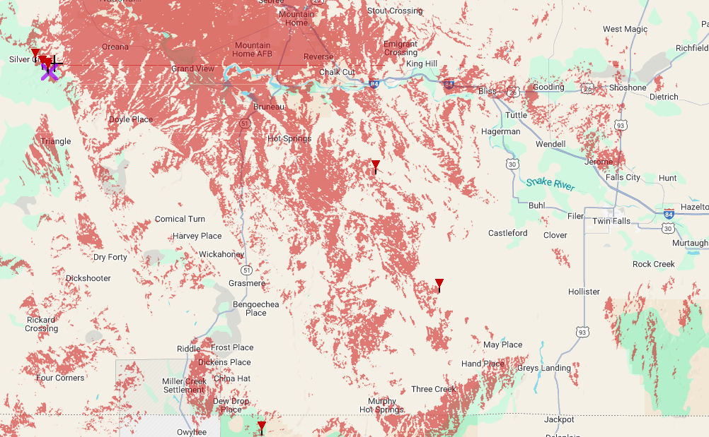

---

#### TVM Pearl
[View in MeshView](https://meshview.freq51.net/node/3020952891)

**Location**: Treasure Valley - Pearl

| Node Name| Radio| Antenna| Battery| Solar| Modem Preset | Slot | Rebroadcast Mode | Firmware       |
|-|-|-|-|-|-|-|-|-|
| TVM Pearl | RAK19007 + 4361 | 10 dBi Helium omni | 10,000 mAh LiPo, 3.7 V | 10 W, 5 V | MEDIUM_FAST | 51 | ALL | 2.6.11 |

#### Site Survey
**TVM Pearl**
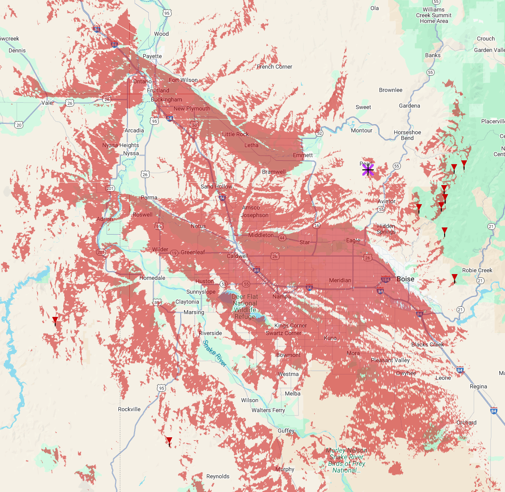

---

#### TVM Tablerock
**Location**: Treasure Valley - Tablerock

| Node Name                      | Radio                                  | Antenna                                                                                                                                                                       | Battery                                                                                                                      | Solar                                                  | Modem Preset | Slot | Rebroadcast Mode | Firmware       |
|-|-|-|-|-|-|-|-|-|
| TVM Tablerock | RAK19007 + 4361 | 10 dBi Helium omni | 10,000 mAh LiPo, 3.7 V | 10 W, 5 V | MEDIUM_FAST | 51 | ALL | 2.6.11 |

#### Site Survey
**TVM Tablerock**
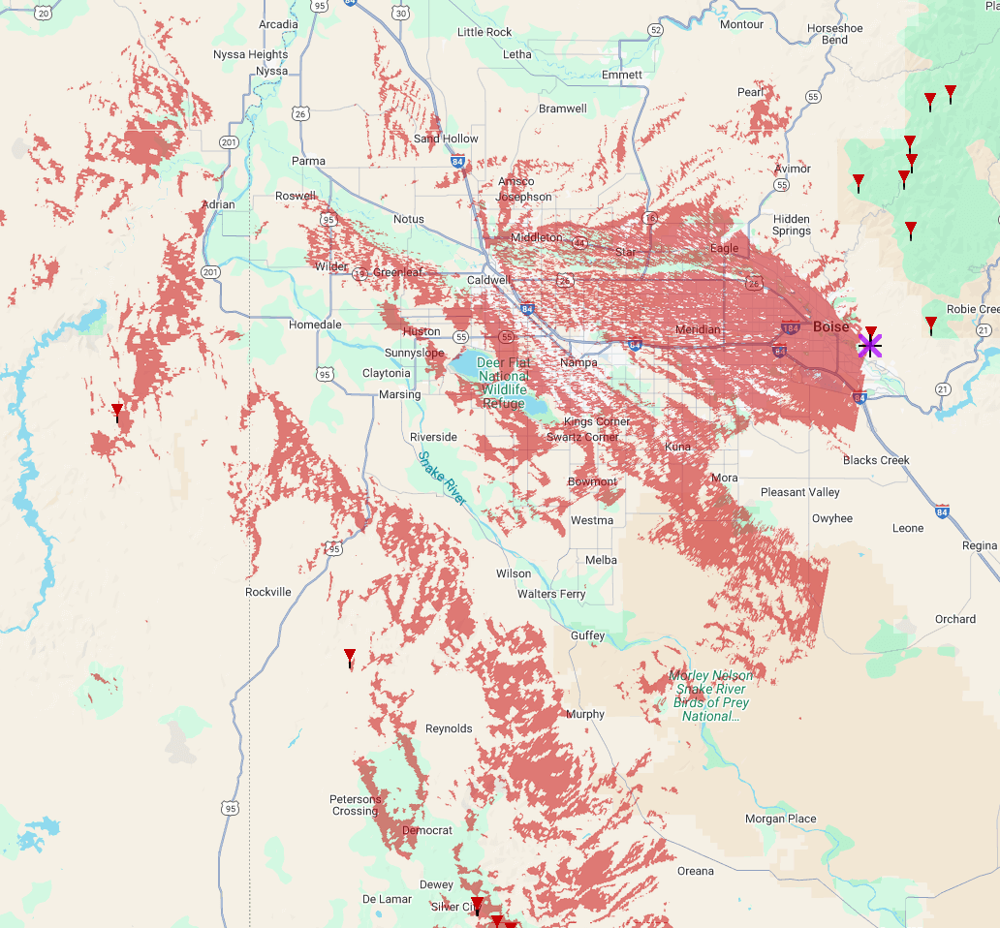
[Return to Table of Contents](#table-of-contents)

---

#### SQB — SWIARC-SQB
[View in MeshView](https://meshview.freq51.net/node/1770277916)

> **Unverified/incomplete — Router.** Current MeshView GPS: 43.98000, -116.41000. Deployment details pending.

*Last edited: August 6, 2026*

---
