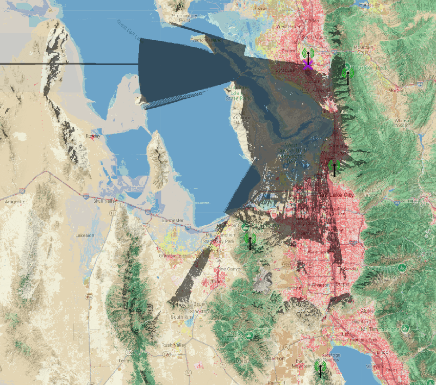

# Freq51 Infrastructure

This page lists deployed routers, router lates, and strategically placed clients. Each entry has a spec table followed by a **Site survey** with associated images. North views are shown first when both are available.

For deployment guidelines, see [Router Deployment Guide](advanced-configuration/router-deployment.md).

---

# Table of Contents

## [Utah Infrastructure](#utah-infrastructure-1)
- [Routers](#routers)
	- [FPR — Francis Peak Router](#fpr--francis-peak-router)
	- [LMR — Lake Mountain Router](#lmr--lake-mountain-router)
	- [NPR — Nelson Peak Router](#npr--nelson-peak-router)
- [Router Lates](#router-lates)
	- [AUR — Aurora Uranialis](#aur--aurora-uranialis)	
	- [POTM — Point of the Mountain](#potm--point-of-the-mountain)
 	- [STIR — Stansbury Island RTR](#stir--stansbury-island-rtr)
- [Strategic Clients](#strategically-placed-clients)
	- [👽 — Alien Tower 🛸](#--alien-tower-)
	- [C6C — Aurora Ceresia](#c6c--aurora-ceresia)
	- [WC1 — Wasatch Crest 1](#wc1--wasatch-crest-1)
	- [WC2 — Wasatch Crest 2](#wc2--wasatch-crest-2)

## [Southern Idaho Infrastructure](#southern-idaho-infrastructure)
- [Routers](#routers-1)
	- [MHR — Mount Harrison Router](#mhr--mount-harrison-router)
    - [ISR — Indian Springs Router](#isr--indian-springs-router-v2)
    - [T2T — The 2 Towers](#t2t--the-2-towers)
    - [tcup — MH Teacup Foothills](#tcup--mh-teacup-foothills)
- [Strategic Clients](#strategically-placed-clients-1)
    - [SSL — Second Star Labs](#ssl--second-star-labs)
	

## [Western Idaho Infrastructure](#western-idaho-infrastructure)
- [Routers](#routers-2)
  - [HPR — Hayden Peak Router](#hpr--hayden-peak-router)
  - [TVM Pearl](#tvm-pearl)
  - [TVM Tablerock](#tvm-tablerock)
---

# Utah Infrastructure
Infrastructure located within Utah.

## Routers

### FPR — Francis Peak Router
**Location:** Francis Peak (Tertiary Peak)

| Node Name              | Radio                            | Antenna        | Battery                           | Solar | Modem Preset | Slot | Rebroadcast Mode | Firmware |
|------------------------|----------------------------------|----------------|-----------------------------------|-------|--------------|------|------------------|----------|
| FPR – Francis Peak Router v5 | Femtofox CE + Baymesh 3 filter | Alfa 5 dBi Omni| 3S3P 18650  | Eco-Worthy 25W   | MEDIUM_FAST    | 51   | ALL              | 2.6.11   |

#### Site survey
**North**  

**South**  

---

### LMR — Lake Mountain Router
**Location:** Lake Mountain Radio Tower

| Node Name               | Radio (modules + enclosure)                                          | Antenna | Battery    | Solar | Modem Preset | Slot | Rebroadcast Mode | Firmware             |
|--------------------------|---------------------------------------------------------------------|---------|------------|-------|--------------|------|------------------|----------------------|
| LAKE – Lake Mountain Rtr | RPi CM3 · Ebyte E22-900M30S · Taoglas filter · Nebra Miner Enclosure| 3 dBi   | Hard-wired | N/A   | MEDIUM_FAST    | 51   | ALL              | Latest Alpha (auto)  |

#### Site survey
**North/South**  

---

### NPR — Nelson Peak Router
**Location:** Nelson Peak

| Node Name                | Radio (modules + enclosure)                | Antenna            | Battery                                                         | Solar | Modem Preset | Slot | Rebroadcast Mode | Firmware |
|--------------------------|--------------------------------------------|--------------------|-----------------------------------------------------------------|-------|--------------|------|------------------|----------|
| NPR – Nelson Peak Router | Nebra with 1W radio and a murata filter    | 45cm gizont 7dBi   | PoE Powered, GOLDENMATE 1000VA/800W Lithium UPS Battery Backup  | None  | MEDIUM_FAST  | 51   | ALL              | 2.7.13    |

#### Site survey
**North**  

**South**  

---

## Router Lates

### AUR — Aurora Uranialis
**Location:** Ensign Peak

| Node Name             | Radio                          | Antenna        | Battery                        | Solar | Modem Preset | Slot | Rebroadcast Mode | Firmware |
|-----------------------|--------------------------------|----------------|--------------------------------|-------|--------------|------|------------------|----------|
| AUR – Aurora Uranialis| RAK4631 + GPIO Labs ISM filter | Alfa 5 dBi Omni| 1S4P 21700 Molicel P50B (20 Ah)| 10 W  | MEDIUM_FAST    | 51   | ALL              | 2.6.4    |

Includes BME680 telemetry every 1800 s.

#### Site survey
**North**  

**South**  

---

### POTM — Point of the Mountain
**Location:** North-facing ridgeline

| Node Name              | Radio              | Antenna | Battery   | Solar | Modem Preset | Slot | Rebroadcast Mode | Firmware |
|------------------------|-------------------|---------|-----------|-------|--------------|------|------------------|----------|
| POTM – Router Late     | RAK19003 + RAK4631| 4 dBi   | 2 × 18650 | 6 W   | MEDIUM_FAST    | 51   | ALL              | 2.6.10   |

#### Site survey
**North**  

**South**  

---

### STIR — Stansbury Island RTR
**Location:** Stansbury Island

| Node Name              | Radio              | Antenna | Battery   | Solar | Modem Preset | Slot | Rebroadcast Mode | Firmware |
|------------------------|-------------------|---------|-----------|-------|--------------|------|------------------|----------|
| STIR – Stansbury Island RTR | Rak 4631 + BME 680 + GPS | Alfa 5 dBi Omni |  16AH   | 6W   | MEDIUM_FAST    | 51   | ALL              | 2.7.11   |

#### Site survey

---

## Strategically Placed Clients

### 👽 — Alien Tower 🛸
**Location:** Alien Tower - Draper

| Node Name              | Radio                          | Antenna        | Battery                        | Solar | Modem Preset | Slot | Rebroadcast Mode | Firmware |
|------------------------|--------------------------------|----------------|--------------------------------|-------|--------------|------|------------------|----------|
| 👽 — Alien Tower 🛸   | RAK4631 + GPIO Labs ISM filter | Alfa 5 dBi Omni | 3 x 18650 | 6 W  | MEDIUM_FAST    | 51   | ALL              | 2.7.11    |

#### Site survey

---

### C6C — Aurora Ceresia
**Location:** Hill AFB – Weber State overlook

| Node Name              | Radio                          | Antenna        | Battery                        | Solar | Modem Preset | Slot | Rebroadcast Mode | Firmware |
|------------------------|--------------------------------|----------------|--------------------------------|-------|--------------|------|------------------|----------|
| C6C – Aurora Ceresia   | RAK4631 + GPIO Labs ISM filter | Alfa 5 dBi Omni| 1S4P 21700 Molicel P50B (20 Ah)| 10 W  | MEDIUM_FAST    | 51   | ALL              | 2.6.4    |

#### Site survey

---

### WC1 — Wasatch Crest 1
**Location:** Silver Peak

| Node Name            | Radio   | Antenna        | Battery                    | Solar | Modem Preset | Slot | Rebroadcast Mode | Firmware |
|-----------------------|---------|----------------|----------------------------|-------|--------------|------|------------------|----------|
| WC1 – Wasatch Crest 1.1 | [SolarXiao Base](https://github.com/wehooper4/Meshtastic-Hardware/tree/main/XaioSeries/SolarXaio) + [Murata DFCB2915MLDJAA](https://www.mouser.com/catalog/specsheets/Murata%20DFCB_DFCH%20Series.pdf) | [Gizont 7dBi 45cm](https://www.aliexpress.us/item/3256806241790045.html) | 1S4P [Molicel P45B](https://www.molicel.com/inr-21700-p45b/)  (18Ah) | 6 W   | MEDIUM_FAST    | 51   | ALL              | 2.6.11    |

#### Site Survey

---

### WC2 — Wasatch Crest 2
**Location:** Squaretop
| Node Name            | Radio      | Antenna           | Battery                      | Solar | Modem Preset | Slot | Rebroadcast Mode | Firmware |
|-----------------------|------------|-------------------|------------------------------|-------|--------------|------|------------------|----------|
| WC2 – Wasatch Crest 2 | [XIAO NRF52](https://www.seeedstudio.com/XIAO-nRF52840-Wio-SX1262-Kit-for-Meshtastic-p-6400.html) + [Murata DFCB2915MLDJAA](https://www.mouser.com/catalog/specsheets/Murata%20DFCB_DFCH%20Series.pdf) | [Gizont 7dBi 45cm](https://www.aliexpress.us/item/3256806241790045.html) | 1S2P [Molicel P45B](https://www.molicel.com/inr-21700-p45b/) (9 Ah) | 6 W   | MEDIUM_FAST    | 51   | ALL              | 2.6.11   |

#### Site Survey

[Return to Table of Contents](#table-of-contents)

---

# Southern Idaho Infrastructure

Infrastructure physically located within Southern Idaho west of Mountain Home through Twin Falls, Burley, and the I-84 corridor to UT.

## Routers

### MHR — Mount Harrison Router
**Location**: Mount Harrison - Southern Idaho

| Node Name                      | Radio                                  | Antenna                                                                                                                                                                       | Battery                                                                                                                      | Solar                                                  | Modem Preset | Slot | Rebroadcast Mode | Firmware       |
|-|-|-|-|-|-|-|-|-|
| MHR — Mount Harrison Router    | Station-G2                          |  [Rokland 8dBi Low Profile Omni](https://store.rokland.com/products/8-dbi-omni-outdoor-915mhz-fiberglass-antenna-for-lora-halow-application) | [3S8P 12.6v 40AH](https://www.18650batterystore.com/collections/21700-batteries/products/eve-50e-21700-5000mah-15a-battery) | [25w 18v ECO-WORTHY](https://a.co/d/85LSbHV)           | MEDIUM_FAST    | 51   | ALL              | 2.6            |

#### Site Survey
**East**

**West**

---

### ISR — Indian Springs Router v2
**Location**: South Hills - Sugarloaf

| Node Name                      | Radio                                  | Antenna                                                                                                                                                                       | Battery                                                                                                                      | Solar                                                  | Modem Preset | Slot | Rebroadcast Mode | Firmware       |
|-|-|-|-|-|-|-|-|-|
| ISR — Indian Springs Router v2 | RAK WisBlock 4631 + Airbuddy Amplifier | [ALFA 5dbi Omni](https://a.co/d/gPpWxbe)                                                                                                                                      | [1S6P 3.7v 40AH](https://www.18650batterystore.com/collections/21700-batteries/products/eve-50e-21700-5000mah-15a-battery)   | [10w 18v ECO-WORTHY](https://a.co/d/eiaV03W)           | MEDIUM_FAST    | 51   | ALL              | 2.6.11         |

#### Site Survey
**East**

**West**

---

### T2T — The 2 Towers
**Location**: Flat Top Butte, Jerome

| Node Name                      | Radio                                  | Antenna                                                                                                                                                                       | Battery                                                                                                                      | Solar                                                  | Modem Preset | Slot | Rebroadcast Mode | Firmware       |
|-|-|-|-|-|-|-|-|-|
| T2T — The 2 Towers        | wehooper4 SolarXaio 1W                            | [8dBi Omni](https://store.rokland.com/products/rakwireless-8-dbi-outdoor-fiberglass-helium-hotspot-antenna-us-868-915-mhz) + [Acasom Cavity Filter](https://acasom.com/products/915mhz-5-types-cavity-filter-for-helium-network-filter-waterproof-lora-indoor-use-high-out-band-rejection?variant=46125490405668) | [1S8P 3.7v 40AH](https://www.18650batterystore.com/collections/21700-batteries/products/eve-50e-21700-5000mah-15a-battery)| [10w 18v ECO-WORTHY](https://a.co/d/eiaV03W)             | MEDIUM_FAST    | 51   | ALL              | 2.6.11         |

#### Site Survey

---

### tcup — MH Teacup Foothills
**Location**: Teapot Dome, Mountain Home

| Node Name                      | Radio                                  | Antenna                                                                                                                                                                       | Battery                                                                                                                      | Solar                                                  | Modem Preset | Slot | Rebroadcast Mode | Firmware       |
|-|-|-|-|-|-|-|-|-|
| tcup — MH Teacup Foothills    | [Wismesh 1W Booster](https://store.rakwireless.com/products/wismesh-1w-booster-starter-kit)|  [Rokland 8dBi Low Profile Omni](https://store.rokland.com/products/8-dbi-omni-outdoor-915mhz-fiberglass-antenna-for-lora-halow-application) | [3.2v LiFePo4 20AH ](https://www.amazon.com/Solar-20000mAh-LiFePO4-Battery-Controller) | [15w5v Integrated Panel + Battery](https://www.amazon.com/Solar-20000mAh-LiFePO4-Battery-Controller)| MEDIUM_FAST   | 51   | ALL  | 2.7.15  
#### Site Survey

---

## Strategically Placed Clients

### SSL — Second Star Labs
**Location**: Second Star Labs

| Node Name                      | Radio                                  | Antenna                                                                                                                                                                       | Battery                                                                                                                      | Solar                                                  | Modem Preset | Slot | Rebroadcast Mode | Firmware       |
|-|-|-|-|-|-|-|-|-|
| SSL — Second Star Labs         | Station G2                             | [Rokland 10dBi Backcountry](https://store.rokland.com/products/10-dbi-backcountry-n-male-omni-outdoor-helium-915-mhz-antenna-48-for-rak-miner-2-nebra-indoor-bobcat-hotspots) | [12v 16AH LiFePo4](https://a.co/d/hoMU9g7)                                                                                   | [25w 18v ECO-WORTHY](https://a.co/d/85LSbHV)           | MEDIUM_FAST    | 51   | ALL              | 2.6.11         |

#### Site Survey

[Return to Table of Contents](#table-of-contents)

---

# Western Idaho Infrastructure
Infrastructure physically located within Western Idaho including Boise, Meridian, Nampa, Mountain Home and surrounding areas.

## Routers

### HPR — Hayden Peak Router
**Location**: Hayden Peak - Boise

| Node Name                      | Radio                                  | Antenna                                                                                                                                                                       | Battery                                                                                                                      | Solar                                                  | Modem Preset | Slot | Rebroadcast Mode | Firmware       |
|-|-|-|-|-|-|-|-|-|
| HPR — Hayden Peak Router    | Femtofox Pro                           |  [Rokland 8dBi Low Profile Omni](https://store.rokland.com/products/8-dbi-omni-outdoor-915mhz-fiberglass-antenna-for-lora-halow-application) | [1S8P 3.7 40AH0](https://www.18650batterystore.com/collections/21700-batteries/products/eve-50e-21700-5000mah-15a-battery) | [25w 18v ECO-WORTHY](https://a.co/d/85LSbHV)           | MEDIUM_FAST   | 51   | ALL              | 2.6            |

**North**

---

### TVM Pearl
**Location**: Treasure Valley - Pearl

| Node Name                      | Radio                                  | Antenna                                                                                                                                                                       | Battery                                                                                                                      | Solar                                                  | Modem Preset | Slot | Rebroadcast Mode | Firmware       |
|-|-|-|-|-|-|-|-|-|
| TVM Pearl   | RAK19007 + 4361                           |  10 dBi Helium Omni | 10000 mAH Lipo 3.7 | 10w 5v       | MEDIUM_FAST    | 51   | ALL              | 2.6.11          |

#### Site Survey
**TVM Pearl**

---

### TVM Tablerock
**Location**: Treasure Valley - Tablerock

| Node Name                      | Radio                                  | Antenna                                                                                                                                                                       | Battery                                                                                                                      | Solar                                                  | Modem Preset | Slot | Rebroadcast Mode | Firmware       |
|-|-|-|-|-|-|-|-|-|
| TVM Pearl   | RAK19007 + 4361                           |  10 dBi Helium Omni | 10000 mAH Lipo 3.7 | 10w 5v       | MEDIUM_FAST    | 51   | ALL              | 2.6.11          |

#### Site Survey
**TVM Tablerock**

[Return to Table of Contents](#table-of-contents)

---
