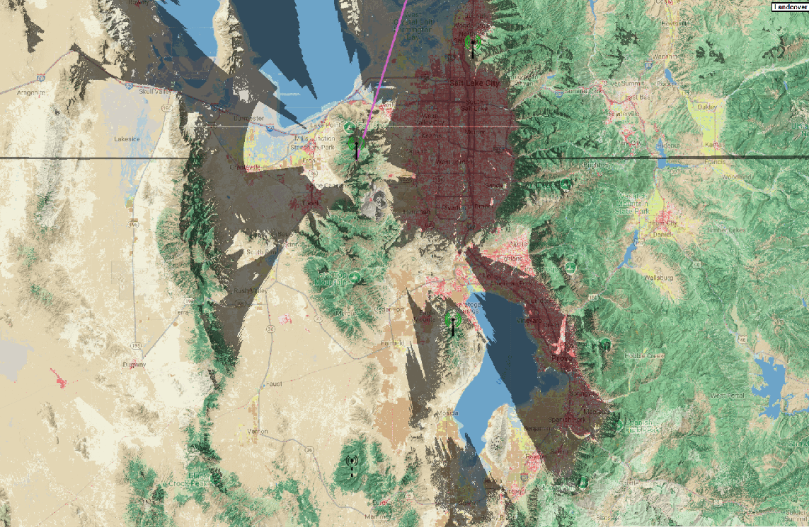
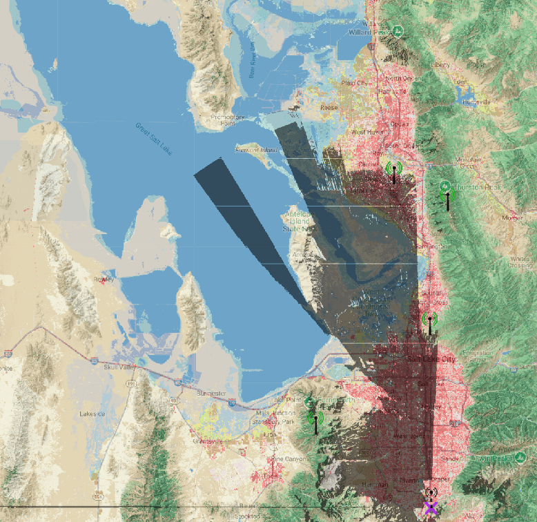

# Freq51 Infrastructure

This page lists deployed routers, router lates, and strategically placed clients. Each entry has a spec table followed by a **Site survey** with associated images. North views are shown first when both are available.

For deployment guidelines, see [Router Deployment Guide](advanced-configuration/router-deployment.md).

---

# Table of Contents

## [Utah Infrastructure](#utah-infrastructure-1)
- [Routers](#routers)
	- [FPR — Francis Peak Router](#fpr--francis-peak-router)
	- [LMR — Lake Mountain Router](#lmr--lake-mountain-router)
	- [NPR — Nelson Peak Router](#npr--nelson-peak-router)
- [Router Lates](#router-lates)
	- [AUR — Aurora Uranialis](#aur--aurora-uranialis)	
	- [POTM — Point of the Mountain](#potm--point-of-the-mountain)
- [Strategic Clients](#strategically-placed-clients)
	- [👽 — Alien Tower 🛸](##--alien-tower-)
	- [C6C — Aurora Ceresia](#c6c--aurora-ceresia)
	- [WC1 — Wasatch Crest 1](#wc1--wasatch-crest-1)
	- [WC2 — Wasatch Crest 2](#wc2--wasatch-crest-2)

## [Idaho Infrastructure](#idaho-infrastructure-1)
- [Routers](#routers-1)
	- [MHR — Mount Harrison Router](#mhr--mount-harrison-router)
    - [ISR — Indian Springs Router](#isr--indian-springs-router-v2)
- [Router Lates](#router-lates-1)
	- [KBS — Kimama Butte Station](#kbs--kimama-butte-station)
- [Strategic Clients](#strategically-placed-clients-1)
    - [SSL — Second Star Labs](#ssl--second-star-labs)

---

# Utah Infrastructure
Infrastructure located within Utah.

## Routers

### FPR — Francis Peak Router
**Location:** Francis Peak (Tertiary Peak)

| Node Name              | Radio                            | Antenna        | Battery                           | Solar | Modem Preset | Slot | Rebroadcast Mode | Firmware |
|------------------------|----------------------------------|----------------|-----------------------------------|-------|--------------|------|------------------|----------|
| FPR – Francis Peak Rtr | Heltec T114V2 + Airbuddy AMP 1 W | Alfa 5 dBi Omni| 1S12P EVE ICR18650 (30.6 Ah)      | 5 W   | MEDIUM_FAST    | 51   | ALL              | 2.6.11   |

Possesses a BME680 for weather & air-quality telemetry every 1800 s.

#### Site survey
**North**  

**South**  

---

### LMR — Lake Mountain Router
**Location:** Lake Mountain Radio Tower

| Node Name               | Radio (modules + enclosure)                                          | Antenna | Battery    | Solar | Modem Preset | Slot | Rebroadcast Mode | Firmware             |
|--------------------------|---------------------------------------------------------------------|---------|------------|-------|--------------|------|------------------|----------------------|
| LAKE – Lake Mountain Rtr | RPi CM3 · Ebyte E22-900M30S · Taoglas filter · Nebra Miner Enclosure| 3 dBi   | Hard-wired | N/A   | MEDIUM_FAST    | 51   | ALL              | Latest Alpha (auto)  |

#### Site survey
**North/South**  

---

### NPR — Nelson Peak Router
**Location:** Nelson Peak

| Node Name              | Radio                 | Antenna | Battery     | Solar | Modem Preset | Slot | Rebroadcast Mode | Firmware |
|------------------------|-----------------------|---------|-------------|-------|--------------|------|------------------|----------|
| NPR – Nelson Peak Rtr  | RAK19003 + RAK4631    | 4 dBi   | 2 × 18650   | 6 W   | LONG_FAST    | 51   | ALL              | 2.3.2    |

#### Site survey
**North**  

**South**  

---

## Router Lates

### AUR — Aurora Uranialis
**Location:** Ensign Peak

| Node Name             | Radio                          | Antenna        | Battery                        | Solar | Modem Preset | Slot | Rebroadcast Mode | Firmware |
|-----------------------|--------------------------------|----------------|--------------------------------|-------|--------------|------|------------------|----------|
| AUR – Aurora Uranialis| RAK4631 + GPIO Labs ISM filter | Alfa 5 dBi Omni| 1S4P 21700 Molicel P50B (20 Ah)| 10 W  | MEDIUM_FAST    | 51   | ALL              | 2.6.4    |

Includes BME680 telemetry every 1800 s.

#### Site survey
**North**  

**South**  

---

### POTM — Point of the Mountain
**Location:** North-facing ridgeline

| Node Name              | Radio              | Antenna | Battery   | Solar | Modem Preset | Slot | Rebroadcast Mode | Firmware |
|------------------------|-------------------|---------|-----------|-------|--------------|------|------------------|----------|
| POTM – Router Late     | RAK19003 + RAK4631| 4 dBi   | 2 × 18650 | 6 W   | MEDIUM_FAST    | 51   | ALL              | 2.6.10   |

#### Site survey
**North**  

**South**  

---

## Strategically Placed Clients

### 👽 — Alien Tower 🛸
**Location:** Alien Tower - Draper

| Node Name              | Radio                          | Antenna        | Battery                        | Solar | Modem Preset | Slot | Rebroadcast Mode | Firmware |
|------------------------|--------------------------------|----------------|--------------------------------|-------|--------------|------|------------------|----------|
| 👽 — Alien Tower 🛸   | RAK4631 + GPIO Labs ISM filter | Alfa 5 dBi Omni | 3 x 18650 | 6 W  | MEDIUM_FAST    | 51   | ALL              | 2.7.11    |

#### Site survey

---

### C6C — Aurora Ceresia
**Location:** Hill AFB – Weber State overlook

| Node Name              | Radio                          | Antenna        | Battery                        | Solar | Modem Preset | Slot | Rebroadcast Mode | Firmware |
|------------------------|--------------------------------|----------------|--------------------------------|-------|--------------|------|------------------|----------|
| C6C – Aurora Ceresia   | RAK4631 + GPIO Labs ISM filter | Alfa 5 dBi Omni| 1S4P 21700 Molicel P50B (20 Ah)| 10 W  | MEDIUM_FAST    | 51   | ALL              | 2.6.4    |

#### Site survey

---

### WC1 — Wasatch Crest 1
**Location:** Silver Peak

| Node Name            | Radio   | Antenna        | Battery                    | Solar | Modem Preset | Slot | Rebroadcast Mode | Firmware |
|-----------------------|---------|----------------|----------------------------|-------|--------------|------|------------------|----------|
| WC1 – Wasatch Crest 1 | RAK4631 | Starf 7 dBi 320mm | 2× Molicel 21700 P42A 8.4Ah| 3 W   | LONG_FAST    | 51   | ALL              | 2.6.10    |

#### Site Survey

---

### WC2 — Wasatch Crest 2
**Location:** Squaretop
| Node Name            | Radio      | Antenna           | Battery                      | Solar | Modem Preset | Slot | Rebroadcast Mode | Firmware |
|-----------------------|------------|-------------------|------------------------------|-------|--------------|------|------------------|----------|
| WC2 – Wasatch Crest 2 | XIAO NRF52 | Gizont 7dBi 450mm | 2× Molicel 21700 P45B  (9 Ah) | 6 W   | LONG_FAST    | 51   | ALL              | 2.6.11   |

#### Site Survey

# Idaho Infrastructure
Infrastructure physically located within Idaho. 

## Routers

### MHR — Mount Harrison Router
**Location**: Mount Harrison

| Node Name                      | Radio                                  | Antenna                                                                                                                                                                       | Battery                                                                                                                      | Solar                                                  | Modem Preset | Slot | Rebroadcast Mode | Firmware       |
|--------------------------------|----------------------------------------|-------------------------------------------------------------------------------------------------------------------------------------------------------------------------------|------------------------------------------------------------------------------------------------------------------------------|--------------------------------------------------------|--------------|------|------------------|----------------|
| MHR — Mount Harrison Router    | Femtofox Pro                           | [Rokland 10dBi Backcountry](https://store.rokland.com/products/10-dbi-backcountry-n-male-omni-outdoor-helium-915-mhz-antenna-48-for-rak-miner-2-nebra-indoor-bobcat-hotspots) | [3S8P 12.6v 40AH0](https://www.18650batterystore.com/collections/21700-batteries/products/eve-50e-21700-5000mah-15a-battery) | [25w 18v ECO-WORTHY](https://a.co/d/85LSbHV)           | LONG_FAST    | 51   | ALL              | 2.6            |

#### Site Survey
**East**

**West**

---

### ISR — Indian Springs Router v2
**Location**: South Hills

| Node Name                      | Radio                                  | Antenna                                                                                                                                                                       | Battery                                                                                                                      | Solar                                                  | Modem Preset | Slot | Rebroadcast Mode | Firmware       |
|--------------------------------|----------------------------------------|-------------------------------------------------------------------------------------------------------------------------------------------------------------------------------|------------------------------------------------------------------------------------------------------------------------------|--------------------------------------------------------|--------------|------|------------------|----------------|
| ISR — Indian Springs Router v2 | RAK WisBlock 4631 + Airbuddy Amplifier | [ALFA 5dbi Omni](https://a.co/d/gPpWxbe)                                                                                                                                      | [1S6P 3.7v 40AH](https://www.18650batterystore.com/collections/21700-batteries/products/eve-50e-21700-5000mah-15a-battery)   | [10w 18v ECO-WORTHY](https://a.co/d/eiaV03W)           | LONG_FAST    | 51   | ALL              | 2.6.11         |

#### Site Survey
**East**

**West**

---

## Router Lates

### KBS — Kimama Butte Station
**Location**: Kimama Butte

| Node Name                      | Radio                                  | Antenna                                                                                                                                                                       | Battery                                                                                                                      | Solar                                                  | Modem Preset | Slot | Rebroadcast Mode | Firmware       |
|--------------------------------|----------------------------------------|-------------------------------------------------------------------------------------------------------------------------------------------------------------------------------|------------------------------------------------------------------------------------------------------------------------------|--------------------------------------------------------|--------------|------|------------------|----------------|
| KBS — Kimama Butte Station     | RAK WisBlock 4631                      | [Hexa Boost 3.6ft 8dBi Omni](https://www.amazon.com/dp/B0953Z1QF3)                                                                                                            | [1S3P 3.7v 10AH](https://www.digikey.com/en/products/detail/adafruit-industries-llc/5035/14625568)                           | [6w 5v Shoshine](https://www.amazon.com/dp/B09ZL3F7CT) | LONG_FAST    | 51   | ALL              | 2.6.11         |

#### Site Survey
**East**

**West**

---

## Strategically Placed Clients

### SSL — Second Star Labs
**Location**: Second Star Labs

| Node Name                      | Radio                                  | Antenna                                                                                                                                                                       | Battery                                                                                                                      | Solar                                                  | Modem Preset | Slot | Rebroadcast Mode | Firmware       |
|--------------------------------|----------------------------------------|-------------------------------------------------------------------------------------------------------------------------------------------------------------------------------|------------------------------------------------------------------------------------------------------------------------------|--------------------------------------------------------|--------------|------|------------------|----------------|
| SSL — Second Star Labs         | Station G2                             | [Rokland 10dBi Backcountry](https://store.rokland.com/products/10-dbi-backcountry-n-male-omni-outdoor-helium-915-mhz-antenna-48-for-rak-miner-2-nebra-indoor-bobcat-hotspots) | [12v 16AH LiFePo4](https://a.co/d/hoMU9g7)                                                                                   | [25w 18v ECO-WORTHY](https://a.co/d/85LSbHV)           | LONG_FAST    | 51   | ALL              | 2.6.11         |

#### Site Survey

