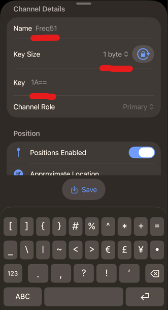

# Migrating Your Node from LONG_FAST ("LongFast") to MEDIUM_FAST ("MediumFast")

This guide will walk you through updating your Meshtastic node's modem preset from **LONG_FAST** (often called "LongFast") to **MEDIUM_FAST** ("MediumFast") on both iOS and Android. These steps ensure a smooth transition and prevent channel name conflicts.

---

## Why Migrate?

- **Network Update:** The community is moving to MEDIUM_FAST for improved balance between range and speed.
- **Compatibility:** Ensures your node stays in sync with the rest of the mesh.

---

## iOS Instructions

### 1. Change the Primary Channel Name

- Go to **Settings**.
- Then select **Channels**.
- Tap your **Primary Channel** (Channel ID: 0, typically the name is blank, unless you have changed it in the past, then it would be "LongFast").
- Change the **Channel Name** to Freq51 then adjust the key size to 1byte, and lastly set the key to "1A==" without quotes.
- Save and confirm the change.

> _This step allows us to set a private channel for all the other meshtastic features to function correctly._



---

### 2. Change the Modem Preset

- Go to **Settings**.
- Find **LoRa**.
- Find presets and select **Medium Fast** (sometimes shown as **MEDIUM_FAST** or **MediumFast**).
- Save your changes.


---

### 3. Reset Your Node Database (nodedb)

- In **Settings**, go to **Device**.
- Locate **Reset NodeDB**, and click it.
- Your node will restart and rebuild its database for the new modem preset.


---

## Android Instructions

### 1. Change the Primary Channel Name

- Go to **Settings**.
- Then go to **Channels**.
- Tap your **Primary Channel** (Channel ID: 0, typically the name is blank, unless you have changed it in the past, then it would be "LongFast").
- Change the **Channel Name** to Freq51 then adjust the key size to 1byte, and lastly set the key to "1A==" without quotes.
- Save and confirm the change.


---

### 2. Change the Modem Preset

- Go to **Settings**.
- Go to **LoRa**.
- Find presets and select **Medium Fast** (may be listed as **MEDIUM_FAST** or **MediumFast**).
- Save your changes.


---

### 3. Reset Your Node Database (nodedb)

- In **Settings**, under Administration find and select **NodeDB Reset**.
- Your node will reboot and rebuild its network database.


---

## CLI instructions

- This configuration can be made with the [Meshtastic Python CLI](https://meshtastic.org/docs/software/python/cli/installation/). Using the following commands:
```
meshtastic --set lora.modemPreset MEDIUM_FAST --set lora.channelNum 51
meshtastic --ch-set name "Freq51" --ch-index 0
meshtastic --ch-set psk "base64:1A==" --ch-index 0
meshtastic --reset-nodedb
```

---

## Troubleshooting

- If your node does not appear on the mesh after migration, double-check that the preset is **MediumFast** and that the primary channel name is Freq51 with the key size as 1byte and Key set to "1A==" No quotes.
- Reboot your node if changes do not appear to take effect.

---

## Need Help?

If you get stuck, please reach out in the community Discord.
